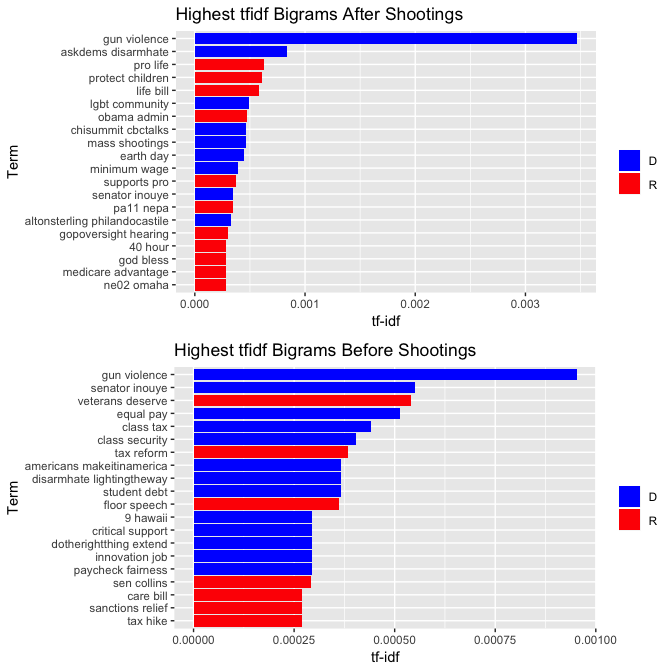
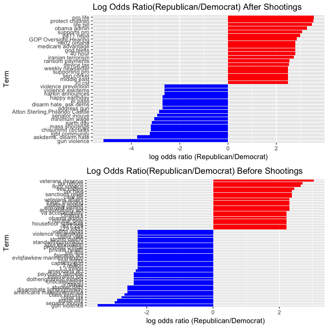
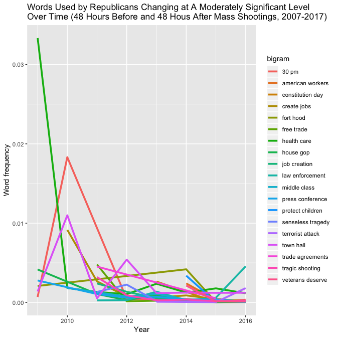
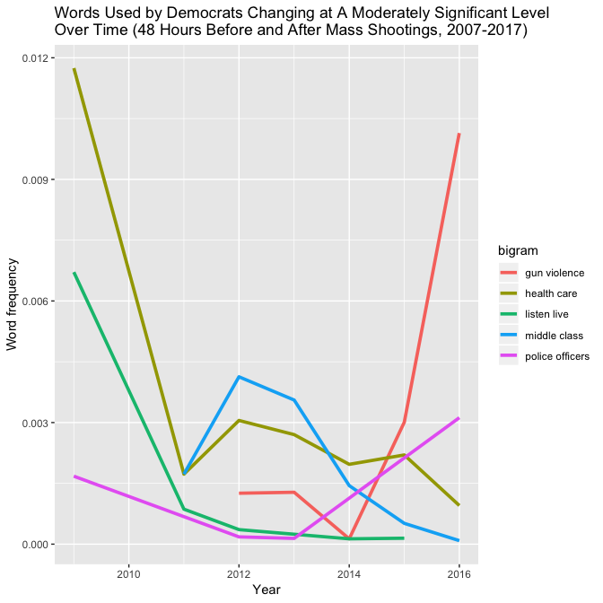
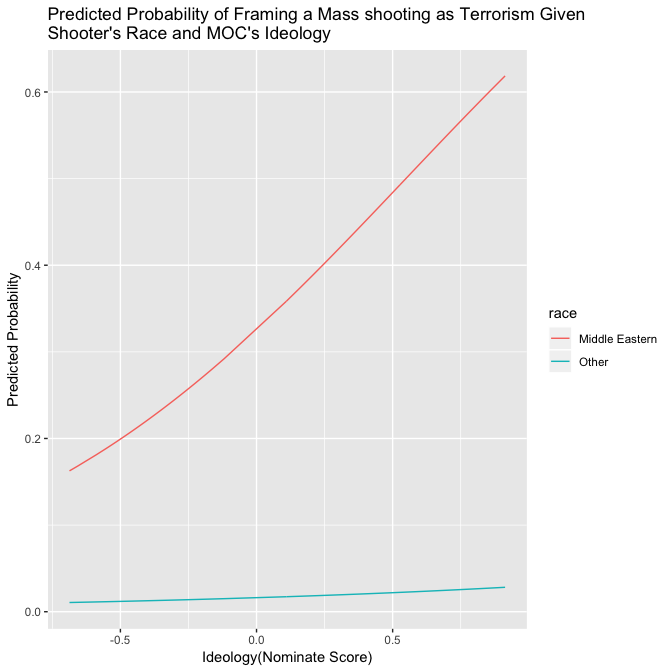

# Congress tweets after shooting

```
## # A tibble: 54,333 x 3
##    word1     word2           n
##    <chr>     <chr>       <int>
##  1 health    care          154
##  2 gun       violence      149
##  3 town      hall          148
##  4 law       enforcement   142
##  5 house     floor         129
##  6 op        ed             96
##  7 house     passed         88
##  8 president obama          82
##  9 navy      yard           79
## 10 happy     birthday       77
## # ... with 54,323 more rows
```

```
## # A tibble: 73,798 x 8
##    Date  Time  R_or_D Before_or_After screen_name hashtags Nominate_dim1
##    <chr> <tim> <chr>  <chr>           <chr>       <chr>            <dbl>
##  1 1/8/… 00:05 D      After           GabbyGiffo… <NA>            -0.11 
##  2 1/8/… 00:05 D      After           GabbyGiffo… <NA>            -0.11 
##  3 1/8/… 00:05 D      After           GabbyGiffo… <NA>            -0.11 
##  4 1/8/… 00:05 D      After           GabbyGiffo… <NA>            -0.11 
##  5 1/8/… 01:53 D      After           SilvestreR… <NA>            -0.321
##  6 1/8/… 01:53 D      After           SilvestreR… <NA>            -0.321
##  7 1/8/… 01:53 D      After           SilvestreR… <NA>            -0.321
##  8 1/8/… 01:53 D      After           SilvestreR… <NA>            -0.321
##  9 1/8/… 01:53 D      After           SilvestreR… <NA>            -0.321
## 10 1/8/… 04:42 D      After           GabbyGiffo… <NA>            -0.11 
## # ... with 73,788 more rows, and 1 more variable: bigram <chr>
```

<table class="table" style="width: auto !important; margin-left: auto; margin-right: auto;">
<caption>Table 1. Highest Tfidf Bigrams in Tweets by Party 48 Hours After Shooting</caption>
 <thead>
  <tr>
   <th style="text-align:left;"> Republican or Democrat </th>
   <th style="text-align:left;"> Term </th>
   <th style="text-align:right;"> n </th>
   <th style="text-align:right;"> tf </th>
   <th style="text-align:right;"> idf </th>
   <th style="text-align:right;"> tf_idf </th>
  </tr>
 </thead>
<tbody>
  <tr>
   <td style="text-align:left;"> D </td>
   <td style="text-align:left;"> gun violence </td>
   <td style="text-align:right;"> 149 </td>
   <td style="text-align:right;"> 0.0050074 </td>
   <td style="text-align:right;"> 0.6931472 </td>
   <td style="text-align:right;"> 0.0034709 </td>
  </tr>
  <tr>
   <td style="text-align:left;"> D </td>
   <td style="text-align:left;"> askdems disarmhate </td>
   <td style="text-align:right;"> 36 </td>
   <td style="text-align:right;"> 0.0012098 </td>
   <td style="text-align:right;"> 0.6931472 </td>
   <td style="text-align:right;"> 0.0008386 </td>
  </tr>
  <tr>
   <td style="text-align:left;"> R </td>
   <td style="text-align:left;"> pro life </td>
   <td style="text-align:right;"> 40 </td>
   <td style="text-align:right;"> 0.0009082 </td>
   <td style="text-align:right;"> 0.6931472 </td>
   <td style="text-align:right;"> 0.0006295 </td>
  </tr>
  <tr>
   <td style="text-align:left;"> R </td>
   <td style="text-align:left;"> protect children </td>
   <td style="text-align:right;"> 39 </td>
   <td style="text-align:right;"> 0.0008855 </td>
   <td style="text-align:right;"> 0.6931472 </td>
   <td style="text-align:right;"> 0.0006138 </td>
  </tr>
  <tr>
   <td style="text-align:left;"> R </td>
   <td style="text-align:left;"> life bill </td>
   <td style="text-align:right;"> 37 </td>
   <td style="text-align:right;"> 0.0008401 </td>
   <td style="text-align:right;"> 0.6931472 </td>
   <td style="text-align:right;"> 0.0005823 </td>
  </tr>
  <tr>
   <td style="text-align:left;"> D </td>
   <td style="text-align:left;"> lgbt community </td>
   <td style="text-align:right;"> 21 </td>
   <td style="text-align:right;"> 0.0007057 </td>
   <td style="text-align:right;"> 0.6931472 </td>
   <td style="text-align:right;"> 0.0004892 </td>
  </tr>
  <tr>
   <td style="text-align:left;"> R </td>
   <td style="text-align:left;"> obama admin </td>
   <td style="text-align:right;"> 30 </td>
   <td style="text-align:right;"> 0.0006812 </td>
   <td style="text-align:right;"> 0.6931472 </td>
   <td style="text-align:right;"> 0.0004721 </td>
  </tr>
  <tr>
   <td style="text-align:left;"> D </td>
   <td style="text-align:left;"> chisummit cbctalks </td>
   <td style="text-align:right;"> 20 </td>
   <td style="text-align:right;"> 0.0006721 </td>
   <td style="text-align:right;"> 0.6931472 </td>
   <td style="text-align:right;"> 0.0004659 </td>
  </tr>
  <tr>
   <td style="text-align:left;"> D </td>
   <td style="text-align:left;"> mass shootings </td>
   <td style="text-align:right;"> 20 </td>
   <td style="text-align:right;"> 0.0006721 </td>
   <td style="text-align:right;"> 0.6931472 </td>
   <td style="text-align:right;"> 0.0004659 </td>
  </tr>
  <tr>
   <td style="text-align:left;"> D </td>
   <td style="text-align:left;"> earth day </td>
   <td style="text-align:right;"> 19 </td>
   <td style="text-align:right;"> 0.0006385 </td>
   <td style="text-align:right;"> 0.6931472 </td>
   <td style="text-align:right;"> 0.0004426 </td>
  </tr>
  <tr>
   <td style="text-align:left;"> D </td>
   <td style="text-align:left;"> minimum wage </td>
   <td style="text-align:right;"> 17 </td>
   <td style="text-align:right;"> 0.0005713 </td>
   <td style="text-align:right;"> 0.6931472 </td>
   <td style="text-align:right;"> 0.0003960 </td>
  </tr>
  <tr>
   <td style="text-align:left;"> R </td>
   <td style="text-align:left;"> supports pro </td>
   <td style="text-align:right;"> 24 </td>
   <td style="text-align:right;"> 0.0005449 </td>
   <td style="text-align:right;"> 0.6931472 </td>
   <td style="text-align:right;"> 0.0003777 </td>
  </tr>
  <tr>
   <td style="text-align:left;"> D </td>
   <td style="text-align:left;"> senator inouye </td>
   <td style="text-align:right;"> 15 </td>
   <td style="text-align:right;"> 0.0005041 </td>
   <td style="text-align:right;"> 0.6931472 </td>
   <td style="text-align:right;"> 0.0003494 </td>
  </tr>
  <tr>
   <td style="text-align:left;"> R </td>
   <td style="text-align:left;"> pa11 nepa </td>
   <td style="text-align:right;"> 22 </td>
   <td style="text-align:right;"> 0.0004995 </td>
   <td style="text-align:right;"> 0.6931472 </td>
   <td style="text-align:right;"> 0.0003462 </td>
  </tr>
  <tr>
   <td style="text-align:left;"> D </td>
   <td style="text-align:left;"> altonsterling philandocastile </td>
   <td style="text-align:right;"> 14 </td>
   <td style="text-align:right;"> 0.0004705 </td>
   <td style="text-align:right;"> 0.6931472 </td>
   <td style="text-align:right;"> 0.0003261 </td>
  </tr>
  <tr>
   <td style="text-align:left;"> R </td>
   <td style="text-align:left;"> gopoversight hearing </td>
   <td style="text-align:right;"> 19 </td>
   <td style="text-align:right;"> 0.0004314 </td>
   <td style="text-align:right;"> 0.6931472 </td>
   <td style="text-align:right;"> 0.0002990 </td>
  </tr>
  <tr>
   <td style="text-align:left;"> R </td>
   <td style="text-align:left;"> 40 hour </td>
   <td style="text-align:right;"> 18 </td>
   <td style="text-align:right;"> 0.0004087 </td>
   <td style="text-align:right;"> 0.6931472 </td>
   <td style="text-align:right;"> 0.0002833 </td>
  </tr>
  <tr>
   <td style="text-align:left;"> R </td>
   <td style="text-align:left;"> god bless </td>
   <td style="text-align:right;"> 18 </td>
   <td style="text-align:right;"> 0.0004087 </td>
   <td style="text-align:right;"> 0.6931472 </td>
   <td style="text-align:right;"> 0.0002833 </td>
  </tr>
  <tr>
   <td style="text-align:left;"> R </td>
   <td style="text-align:left;"> medicare advantage </td>
   <td style="text-align:right;"> 18 </td>
   <td style="text-align:right;"> 0.0004087 </td>
   <td style="text-align:right;"> 0.6931472 </td>
   <td style="text-align:right;"> 0.0002833 </td>
  </tr>
  <tr>
   <td style="text-align:left;"> R </td>
   <td style="text-align:left;"> ne02 omaha </td>
   <td style="text-align:right;"> 18 </td>
   <td style="text-align:right;"> 0.0004087 </td>
   <td style="text-align:right;"> 0.6931472 </td>
   <td style="text-align:right;"> 0.0002833 </td>
  </tr>
</tbody>
</table>

<!-- -->

#Logs Ratio for after shootings

```
## # A tibble: 54,333 x 4
##    bigram                    D         R logratio
##    <chr>                 <dbl>     <dbl>    <dbl>
##  1 families affected 0.000214  0.000213  -0.00276
##  2 protect americans 0.0000714 0.0000712 -0.00276
##  3 sandy hook        0.0000714 0.0000712 -0.00276
##  4 2 2               0.000202  0.000203   0.00561
##  5 bipartisan bill   0.000202  0.000203   0.00561
##  6 middle school     0.000155  0.000152  -0.0138 
##  7 1 2               0.000250  0.000254   0.0174 
##  8 care reform       0.0000832 0.0000813 -0.0234 
##  9 committee hearing 0.000166  0.000163  -0.0234 
## 10 families friends  0.0000832 0.0000813 -0.0234 
## # ... with 54,323 more rows
```

<!-- -->

#Comparing words frequency by plotting(after shooting)


```
## # A tibble: 56,844 x 5
## # Groups:   R_or_D [2]
##    R_or_D bigram              n total    freq
##    <chr>  <chr>           <int> <int>   <dbl>
##  1 D      gun violence      149 29756 0.00501
##  2 R      law enforcement   103 44042 0.00234
##  3 R      health care        96 44042 0.00218
##  4 R      house passed       77 44042 0.00175
##  5 R      house floor        76 44042 0.00173
##  6 D      town hall          75 29756 0.00252
##  7 R      town hall          73 44042 0.00166
##  8 R      op ed              68 44042 0.00154
##  9 R      president obama    62 44042 0.00141
## 10 R      watch live         60 44042 0.00136
## # ... with 56,834 more rows
```

```
## # A tibble: 54,333 x 3
##    bigram              D         R
##    <chr>           <dbl>     <dbl>
##  1 1 15        0.0000336 0.0000227
##  2 1 15pm      0.0000336 0.0000227
##  3 1 40        0.0000336 0.0000227
##  4 1 45        0.0000336 0.0000227
##  5 1.3 billion 0.0000336 0.0000227
##  6 1.9 million 0.0000336 0.0000227
##  7 10 10       0.0000336 0.0000227
##  8 100 million 0.0000336 0.0000227
##  9 100 people  0.0000336 0.0000227
## 10 100 rating  0.0000336 0.0000227
## # ... with 54,323 more rows
```

<!-- -->

#Congress tweets before shootings


```
## # A tibble: 104,804 x 2
##    word          n
##    <fct>     <int>
##  1 of the      720
##  2 on the      555
##  3 in the      524
##  4 to the      494
##  5 the house   333
##  6 for the     327
##  7 at the      275
##  8 thank you   236
##  9 will be     216
## 10 proud to    207
## # ... with 104,794 more rows
```

```
## # A tibble: 38,511 x 3
##    word1     word2        n
##    <chr>     <chr>    <int>
##  1 health    care       111
##  2 house     floor      111
##  3 town      hall        78
##  4 watch     live        74
##  5 op        ed          72
##  6 middle    class       70
##  7 american  people      63
##  8 national  security    59
##  9 happy     birthday    56
## 10 president obama       47
## # ... with 38,501 more rows
```

```
## # A tibble: 49,635 x 8
##    Date  Time  R_or_D Before_or_After screen_name hashtags Nominate_dim1
##    <chr> <tim> <chr>  <chr>           <chr>       <chr>            <dbl>
##  1 1/10… 00:02 D      Before          RepVisclos… <NA>            -0.402
##  2 1/10… 00:02 D      Before          RepVisclos… <NA>            -0.402
##  3 1/10… 00:02 D      Before          RepVisclos… <NA>            -0.402
##  4 1/10… 00:02 D      Before          RepVisclos… <NA>            -0.402
##  5 1/10… 00:59 R      Before          RepKayGran… <NA>             0.392
##  6 1/10… 00:59 R      Before          RepKayGran… <NA>             0.392
##  7 1/10… 00:59 R      Before          RepKayGran… <NA>             0.392
##  8 1/10… 03:39 R      Before          DevinNunes  <NA>             0.448
##  9 1/10… 03:39 R      Before          DevinNunes  <NA>             0.448
## 10 1/10… 03:39 R      Before          DevinNunes  <NA>             0.448
## # ... with 49,625 more rows, and 1 more variable: bigram <chr>
```

<table class="table" style="width: auto !important; margin-left: auto; margin-right: auto;">
<caption>Table 1. Highest Tfidf Bigrams in Tweets by Party 48 hours Before Shooting</caption>
 <thead>
  <tr>
   <th style="text-align:left;"> Republican or Democrat </th>
   <th style="text-align:left;"> Term </th>
   <th style="text-align:right;"> n </th>
   <th style="text-align:right;"> tf </th>
   <th style="text-align:right;"> idf </th>
   <th style="text-align:right;"> tf_idf </th>
  </tr>
 </thead>
<tbody>
  <tr>
   <td style="text-align:left;"> D </td>
   <td style="text-align:left;"> gun violence </td>
   <td style="text-align:right;"> 26 </td>
   <td style="text-align:right;"> 0.0013762 </td>
   <td style="text-align:right;"> 0.6931472 </td>
   <td style="text-align:right;"> 0.0009539 </td>
  </tr>
  <tr>
   <td style="text-align:left;"> D </td>
   <td style="text-align:left;"> senator inouye </td>
   <td style="text-align:right;"> 15 </td>
   <td style="text-align:right;"> 0.0007940 </td>
   <td style="text-align:right;"> 0.6931472 </td>
   <td style="text-align:right;"> 0.0005503 </td>
  </tr>
  <tr>
   <td style="text-align:left;"> R </td>
   <td style="text-align:left;"> veterans deserve </td>
   <td style="text-align:right;"> 24 </td>
   <td style="text-align:right;"> 0.0007807 </td>
   <td style="text-align:right;"> 0.6931472 </td>
   <td style="text-align:right;"> 0.0005411 </td>
  </tr>
  <tr>
   <td style="text-align:left;"> D </td>
   <td style="text-align:left;"> equal pay </td>
   <td style="text-align:right;"> 14 </td>
   <td style="text-align:right;"> 0.0007411 </td>
   <td style="text-align:right;"> 0.6931472 </td>
   <td style="text-align:right;"> 0.0005137 </td>
  </tr>
  <tr>
   <td style="text-align:left;"> D </td>
   <td style="text-align:left;"> class tax </td>
   <td style="text-align:right;"> 12 </td>
   <td style="text-align:right;"> 0.0006352 </td>
   <td style="text-align:right;"> 0.6931472 </td>
   <td style="text-align:right;"> 0.0004403 </td>
  </tr>
  <tr>
   <td style="text-align:left;"> D </td>
   <td style="text-align:left;"> class security </td>
   <td style="text-align:right;"> 11 </td>
   <td style="text-align:right;"> 0.0005823 </td>
   <td style="text-align:right;"> 0.6931472 </td>
   <td style="text-align:right;"> 0.0004036 </td>
  </tr>
  <tr>
   <td style="text-align:left;"> R </td>
   <td style="text-align:left;"> tax reform </td>
   <td style="text-align:right;"> 17 </td>
   <td style="text-align:right;"> 0.0005530 </td>
   <td style="text-align:right;"> 0.6931472 </td>
   <td style="text-align:right;"> 0.0003833 </td>
  </tr>
  <tr>
   <td style="text-align:left;"> D </td>
   <td style="text-align:left;"> americans makeitinamerica </td>
   <td style="text-align:right;"> 10 </td>
   <td style="text-align:right;"> 0.0005293 </td>
   <td style="text-align:right;"> 0.6931472 </td>
   <td style="text-align:right;"> 0.0003669 </td>
  </tr>
  <tr>
   <td style="text-align:left;"> D </td>
   <td style="text-align:left;"> disarmhate lightingtheway </td>
   <td style="text-align:right;"> 10 </td>
   <td style="text-align:right;"> 0.0005293 </td>
   <td style="text-align:right;"> 0.6931472 </td>
   <td style="text-align:right;"> 0.0003669 </td>
  </tr>
  <tr>
   <td style="text-align:left;"> D </td>
   <td style="text-align:left;"> student debt </td>
   <td style="text-align:right;"> 10 </td>
   <td style="text-align:right;"> 0.0005293 </td>
   <td style="text-align:right;"> 0.6931472 </td>
   <td style="text-align:right;"> 0.0003669 </td>
  </tr>
  <tr>
   <td style="text-align:left;"> R </td>
   <td style="text-align:left;"> floor speech </td>
   <td style="text-align:right;"> 16 </td>
   <td style="text-align:right;"> 0.0005204 </td>
   <td style="text-align:right;"> 0.6931472 </td>
   <td style="text-align:right;"> 0.0003607 </td>
  </tr>
  <tr>
   <td style="text-align:left;"> D </td>
   <td style="text-align:left;"> 9 hawaii </td>
   <td style="text-align:right;"> 8 </td>
   <td style="text-align:right;"> 0.0004235 </td>
   <td style="text-align:right;"> 0.6931472 </td>
   <td style="text-align:right;"> 0.0002935 </td>
  </tr>
  <tr>
   <td style="text-align:left;"> D </td>
   <td style="text-align:left;"> critical support </td>
   <td style="text-align:right;"> 8 </td>
   <td style="text-align:right;"> 0.0004235 </td>
   <td style="text-align:right;"> 0.6931472 </td>
   <td style="text-align:right;"> 0.0002935 </td>
  </tr>
  <tr>
   <td style="text-align:left;"> D </td>
   <td style="text-align:left;"> dotherightthing extend </td>
   <td style="text-align:right;"> 8 </td>
   <td style="text-align:right;"> 0.0004235 </td>
   <td style="text-align:right;"> 0.6931472 </td>
   <td style="text-align:right;"> 0.0002935 </td>
  </tr>
  <tr>
   <td style="text-align:left;"> D </td>
   <td style="text-align:left;"> innovation job </td>
   <td style="text-align:right;"> 8 </td>
   <td style="text-align:right;"> 0.0004235 </td>
   <td style="text-align:right;"> 0.6931472 </td>
   <td style="text-align:right;"> 0.0002935 </td>
  </tr>
  <tr>
   <td style="text-align:left;"> D </td>
   <td style="text-align:left;"> paycheck fairness </td>
   <td style="text-align:right;"> 8 </td>
   <td style="text-align:right;"> 0.0004235 </td>
   <td style="text-align:right;"> 0.6931472 </td>
   <td style="text-align:right;"> 0.0002935 </td>
  </tr>
  <tr>
   <td style="text-align:left;"> R </td>
   <td style="text-align:left;"> sen collins </td>
   <td style="text-align:right;"> 13 </td>
   <td style="text-align:right;"> 0.0004229 </td>
   <td style="text-align:right;"> 0.6931472 </td>
   <td style="text-align:right;"> 0.0002931 </td>
  </tr>
  <tr>
   <td style="text-align:left;"> R </td>
   <td style="text-align:left;"> care bill </td>
   <td style="text-align:right;"> 12 </td>
   <td style="text-align:right;"> 0.0003903 </td>
   <td style="text-align:right;"> 0.6931472 </td>
   <td style="text-align:right;"> 0.0002706 </td>
  </tr>
  <tr>
   <td style="text-align:left;"> R </td>
   <td style="text-align:left;"> sanctions relief </td>
   <td style="text-align:right;"> 12 </td>
   <td style="text-align:right;"> 0.0003903 </td>
   <td style="text-align:right;"> 0.6931472 </td>
   <td style="text-align:right;"> 0.0002706 </td>
  </tr>
  <tr>
   <td style="text-align:left;"> R </td>
   <td style="text-align:left;"> tax hike </td>
   <td style="text-align:right;"> 12 </td>
   <td style="text-align:right;"> 0.0003903 </td>
   <td style="text-align:right;"> 0.6931472 </td>
   <td style="text-align:right;"> 0.0002706 </td>
  </tr>
</tbody>
</table>

<!-- -->
#Logs Ratio for before shooting


```
## # A tibble: 38,511 x 4
##    bigram                     D         R logratio
##    <chr>                  <dbl>     <dbl>    <dbl>
##  1 1 million          0.0000871 0.0000866 -0.00536
##  2 7 30               0.0000871 0.0000866 -0.00536
##  3 save lives         0.0000871 0.0000866 -0.00536
##  4 step forward       0.0000871 0.0000866 -0.00536
##  5 30 pm              0.000105  0.000101  -0.0335 
##  6 american flag      0.000105  0.000101  -0.0335 
##  7 gabrielle giffords 0.000105  0.000101  -0.0335 
##  8 6 30               0.0000697 0.0000722  0.0355 
##  9 appropriations act 0.0000697 0.0000722  0.0355 
## 10 beautiful day      0.0000697 0.0000722  0.0355 
## # ... with 38,501 more rows
```

<!-- -->
#Comparing all graphs

<!-- --><!-- -->

#Joining before and after shooting dataframes


```
## # A tibble: 87,296 x 3
##    word1     word2           n
##    <chr>     <chr>       <int>
##  1 health    care          265
##  2 house     floor         240
##  3 town      hall          226
##  4 gun       violence      175
##  5 op        ed            168
##  6 law       enforcement   161
##  7 watch     live          144
##  8 happy     birthday      133
##  9 president obama         129
## 10 house     passed        126
## # ... with 87,286 more rows
```

```
## # A tibble: 123,408 x 8
##    Date  Time  R_or_D Before_or_After screen_name hashtags Nominate_dim1
##    <chr> <tim> <chr>  <chr>           <chr>       <chr>            <dbl>
##  1 1/10… 00:02 D      Before          RepVisclos… <NA>            -0.402
##  2 1/10… 00:02 D      Before          RepVisclos… <NA>            -0.402
##  3 1/10… 00:02 D      Before          RepVisclos… <NA>            -0.402
##  4 1/10… 00:02 D      Before          RepVisclos… <NA>            -0.402
##  5 1/10… 00:59 R      Before          RepKayGran… <NA>             0.392
##  6 1/10… 00:59 R      Before          RepKayGran… <NA>             0.392
##  7 1/10… 00:59 R      Before          RepKayGran… <NA>             0.392
##  8 1/10… 03:39 R      Before          DevinNunes  <NA>             0.448
##  9 1/10… 03:39 R      Before          DevinNunes  <NA>             0.448
## 10 1/10… 03:39 R      Before          DevinNunes  <NA>             0.448
## # ... with 123,398 more rows, and 1 more variable: bigram <chr>
```
#Words over time


```
## # A tibble: 910 x 6
##    time_floor          R_or_D bigram            count time_total word_total
##    <dttm>              <chr>  <chr>             <int>      <int>      <int>
##  1 2009-01-01 00:00:00 D      30 pm                 1        596         43
##  2 2009-01-01 00:00:00 D      american people       1        596        120
##  3 2009-01-01 00:00:00 D      capitol hill          1        596         45
##  4 2009-01-01 00:00:00 D      committee hearing     1        596         36
##  5 2009-01-01 00:00:00 D      fort hood             1        596         63
##  6 2009-01-01 00:00:00 D      health care           7        596        265
##  7 2009-01-01 00:00:00 D      health insurance      2        596         41
##  8 2009-01-01 00:00:00 D      house floor           2        596        240
##  9 2009-01-01 00:00:00 D      listen live           4        596         72
## 10 2009-01-01 00:00:00 D      op ed                 2        596        168
## # ... with 900 more rows
```

```
## # A tibble: 200 x 3
##    R_or_D bigram            data            
##    <chr>  <chr>             <list>          
##  1 D      30 pm             <tibble [6 × 4]>
##  2 D      american people   <tibble [6 × 4]>
##  3 D      capitol hill      <tibble [5 × 4]>
##  4 D      committee hearing <tibble [7 × 4]>
##  5 D      fort hood         <tibble [2 × 4]>
##  6 D      health care       <tibble [7 × 4]>
##  7 D      health insurance  <tibble [7 × 4]>
##  8 D      house floor       <tibble [7 × 4]>
##  9 D      listen live       <tibble [5 × 4]>
## 10 D      op ed             <tibble [7 × 4]>
## # ... with 190 more rows
```

```
## # A tibble: 200 x 4
##    R_or_D bigram            data             models   
##    <chr>  <chr>             <list>           <list>   
##  1 D      30 pm             <tibble [6 × 4]> <S3: glm>
##  2 D      american people   <tibble [6 × 4]> <S3: glm>
##  3 D      capitol hill      <tibble [5 × 4]> <S3: glm>
##  4 D      committee hearing <tibble [7 × 4]> <S3: glm>
##  5 D      fort hood         <tibble [2 × 4]> <S3: glm>
##  6 D      health care       <tibble [7 × 4]> <S3: glm>
##  7 D      health insurance  <tibble [7 × 4]> <S3: glm>
##  8 D      house floor       <tibble [7 × 4]> <S3: glm>
##  9 D      listen live       <tibble [5 × 4]> <S3: glm>
## 10 D      op ed             <tibble [7 × 4]> <S3: glm>
## # ... with 190 more rows
```

```
## # A tibble: 24 x 8
##    R_or_D bigram term  estimate std.error statistic  p.value
##    <chr>  <chr>  <chr>    <dbl>     <dbl>     <dbl>    <dbl>
##  1 D      healt… time… -7.07e-9   1.75e-9     -4.05 5.22e- 5
##  2 D      liste… time… -2.20e-8   5.11e-9     -4.31 1.66e- 5
##  3 D      polic… time…  2.07e-8   4.87e-9      4.25 2.10e- 5
##  4 R      30 pm  time… -1.44e-8   2.58e-9     -5.57 2.57e- 8
##  5 R      fort … time… -1.14e-8   1.81e-9     -6.27 3.62e-10
##  6 R      healt… time… -1.31e-8   1.20e-9    -11.0  4.24e-28
##  7 R      house… time… -1.72e-8   2.85e-9     -6.06 1.36e- 9
##  8 R      press… time… -1.12e-8   2.65e-9     -4.22 2.46e- 5
##  9 R      town … time… -6.14e-9   1.51e-9     -4.06 4.96e- 5
## 10 R      creat… time… -1.53e-8   2.69e-9     -5.70 1.22e- 8
## # ... with 14 more rows, and 1 more variable: adjusted.p.value <dbl>
```

<!-- --><!-- -->

#Building a dtm to find association

```
## <<SimpleCorpus>>
## Metadata:  corpus specific: 1, document level (indexed): 0
## Content:  documents: 17902
```

```
## <<TermDocumentMatrix (terms: 19813, documents: 17902)>>
## Non-/sparse entries: 184359/354507967
## Sparsity           : 100%
## Maximal term length: 45
## Weighting          : term frequency (tf)
```

```
## $terror
## iranian notonec    iran sponsor 
##    0.34    0.30    0.21    0.20
```

```
## <<SimpleCorpus>>
## Metadata:  corpus specific: 1, document level (indexed): 0
## Content:  documents: 11679
```

```
## <<TermDocumentMatrix (terms: 15546, documents: 11679)>>
## Non-/sparse entries: 119964/181441770
## Sparsity           : 100%
## Maximal term length: 38
## Weighting          : term frequency (tf)
```

```
## $terror
## notonec sponsor   franc    nice 
##    0.24    0.22    0.21    0.20
```

```
## <<SimpleCorpus>>
## Metadata:  corpus specific: 1, document level (indexed): 0
## Content:  documents: 10718
```

```
## <<TermDocumentMatrix (terms: 13466, documents: 10718)>>
## Non-/sparse entries: 108303/144220285
## Sparsity           : 100%
## Maximal term length: 32
## Weighting          : term frequency (tf)
```

<table class="kable_wrapper table table-striped" style="margin-left: auto; margin-right: auto;">
<caption>Words correlated with the word terror at r&gt;0.2 among Republicans after shootings</caption>
<tbody>
  <tr>
   <td> 

<table>
 <thead>
  <tr>
   <th style="text-align:left;">   </th>
   <th style="text-align:right;"> r </th>
  </tr>
 </thead>
<tbody>
  <tr>
   <td style="text-align:left;"> iranian </td>
   <td style="text-align:right;"> 0.38 </td>
  </tr>
  <tr>
   <td style="text-align:left;"> notonec </td>
   <td style="text-align:right;"> 0.33 </td>
  </tr>
  <tr>
   <td style="text-align:left;"> sponsor </td>
   <td style="text-align:right;"> 0.25 </td>
  </tr>
  <tr>
   <td style="text-align:left;"> iran </td>
   <td style="text-align:right;"> 0.24 </td>
  </tr>
  <tr>
   <td style="text-align:left;"> victim </td>
   <td style="text-align:right;"> 0.22 </td>
  </tr>
  <tr>
   <td style="text-align:left;"> repmeehan </td>
   <td style="text-align:right;"> 0.22 </td>
  </tr>
  <tr>
   <td style="text-align:left;"> justic </td>
   <td style="text-align:right;"> 0.21 </td>
  </tr>
  <tr>
   <td style="text-align:left;"> statesponsor </td>
   <td style="text-align:right;"> 0.21 </td>
  </tr>
</tbody>
</table>

 </td>
  </tr>
</tbody>
<tfoot><tr><td style="padding: 0; border: 0;" colspan="100%">
<sup>1</sup> Footnote1; notonec refers to the hashtag NotOneCent. The hashtag was used during Iran nuclear negotions<br>           by those who opposed unfreezing Iran's assetts. </td></tr></tfoot>
</table>

```
## <<SimpleCorpus>>
## Metadata:  corpus specific: 1, document level (indexed): 0
## Content:  documents: 7184
```

```
## <<TermDocumentMatrix (terms: 11467, documents: 7184)>>
## Non-/sparse entries: 76056/82302872
## Sparsity           : 100%
## Maximal term length: 45
## Weighting          : term frequency (tf)
```

<table class="kable_wrapper table" style="margin-left: auto; margin-right: auto;">
<caption>Words correlated with the word terror at r&gt;0.2 among Democrats after shootings</caption>
<tbody>
  <tr>
   <td> 

<table>
 <thead>
  <tr>
   <th style="text-align:left;">   </th>
   <th style="text-align:right;"> r </th>
  </tr>
 </thead>
<tbody>
  <tr>
   <td style="text-align:left;"> impuls </td>
   <td style="text-align:right;"> 0.26 </td>
  </tr>
  <tr>
   <td style="text-align:left;"> hate </td>
   <td style="text-align:right;"> 0.22 </td>
  </tr>
</tbody>
</table>

 </td>
  </tr>
</tbody>
</table>

```
## <<SimpleCorpus>>
## Metadata:  corpus specific: 1, document level (indexed): 0
## Content:  documents: 7342
```

```
## <<TermDocumentMatrix (terms: 11027, documents: 7342)>>
## Non-/sparse entries: 74195/80886039
## Sparsity           : 100%
## Maximal term length: 33
## Weighting          : term frequency (tf)
```

<table class="kable_wrapper table" style="margin-left: auto; margin-right: auto;">
<caption>Words correlated with the word terror at r&gt;0.2 among Republicans before shootings</caption>
<tbody>
  <tr>
   <td> 

<table>
 <thead>
  <tr>
   <th style="text-align:left;">   </th>
   <th style="text-align:right;"> r </th>
  </tr>
 </thead>
<tbody>
  <tr>
   <td style="text-align:left;"> sponsor </td>
   <td style="text-align:right;"> 0.27 </td>
  </tr>
  <tr>
   <td style="text-align:left;"> notonec </td>
   <td style="text-align:right;"> 0.26 </td>
  </tr>
  <tr>
   <td style="text-align:left;"> franc </td>
   <td style="text-align:right;"> 0.23 </td>
  </tr>
  <tr>
   <td style="text-align:left;"> attack </td>
   <td style="text-align:right;"> 0.22 </td>
  </tr>
</tbody>
</table>

 </td>
  </tr>
</tbody>
<tfoot>
<tr><td style="padding: 0; border: 0;" colspan="100%">
<sup>1</sup> Footnote1; franc refers to terrorist attack in Nice, France. The attack occured on July 14,2016 exactly 48 hours before the Bouton Rouge Mass Shooting in the U.S.</td></tr>
<tr><td style="padding: 0; border: 0;" colspan="100%">
<sup>2</sup> Footnote2; notonec refers to the hashtag NotOneCent. The hashtag was used during Iran nuclear negotions by those who opposed unfreezing Iran's assetts. </td></tr>
</tfoot>
</table>

```
## <<SimpleCorpus>>
## Metadata:  corpus specific: 1, document level (indexed): 0
## Content:  documents: 4337
```

```
## <<TermDocumentMatrix (terms: 8613, documents: 4337)>>
## Non-/sparse entries: 45769/37308812
## Sparsity           : 100%
## Maximal term length: 38
## Weighting          : term frequency (tf)
```

<table class="kable_wrapper table" style="margin-left: auto; margin-right: auto;">
<caption>Words correlated with the word terror at r&gt;0.2 among Democrats  before shootings</caption>
<tbody>
  <tr>
   <td> 

<table>
 <thead>
  <tr>
   <th style="text-align:left;">   </th>
   <th style="text-align:right;"> r </th>
  </tr>
 </thead>
<tbody>
  <tr>
   <td style="text-align:left;"> nice </td>
   <td style="text-align:right;"> 0.31 </td>
  </tr>
  <tr>
   <td style="text-align:left;"> prevail </td>
   <td style="text-align:right;"> 0.27 </td>
  </tr>
  <tr>
   <td style="text-align:left;"> dispos </td>
   <td style="text-align:right;"> 0.27 </td>
  </tr>
  <tr>
   <td style="text-align:left;"> intnl </td>
   <td style="text-align:right;"> 0.27 </td>
  </tr>
  <tr>
   <td style="text-align:left;"> hostil </td>
   <td style="text-align:right;"> 0.27 </td>
  </tr>
  <tr>
   <td style="text-align:left;"> houthi </td>
   <td style="text-align:right;"> 0.27 </td>
  </tr>
  <tr>
   <td style="text-align:left;"> rebel </td>
   <td style="text-align:right;"> 0.27 </td>
  </tr>
  <tr>
   <td style="text-align:left;"> unrel </td>
   <td style="text-align:right;"> 0.27 </td>
  </tr>
  <tr>
   <td style="text-align:left;"> yemen </td>
   <td style="text-align:right;"> 0.27 </td>
  </tr>
  <tr>
   <td style="text-align:left;"> shaken </td>
   <td style="text-align:right;"> 0.27 </td>
  </tr>
  <tr>
   <td style="text-align:left;"> dozen </td>
   <td style="text-align:right;"> 0.27 </td>
  </tr>
  <tr>
   <td style="text-align:left;"> wfranc </td>
   <td style="text-align:right;"> 0.27 </td>
  </tr>
  <tr>
   <td style="text-align:left;"> percept </td>
   <td style="text-align:right;"> 0.27 </td>
  </tr>
  <tr>
   <td style="text-align:left;"> pivot </td>
   <td style="text-align:right;"> 0.27 </td>
  </tr>
  <tr>
   <td style="text-align:left;"> rcdefens </td>
   <td style="text-align:right;"> 0.27 </td>
  </tr>
  <tr>
   <td style="text-align:left;"> suggest </td>
   <td style="text-align:right;"> 0.27 </td>
  </tr>
  <tr>
   <td style="text-align:left;"> appal </td>
   <td style="text-align:right;"> 0.27 </td>
  </tr>
  <tr>
   <td style="text-align:left;"> providersclin </td>
   <td style="text-align:right;"> 0.27 </td>
  </tr>
  <tr>
   <td style="text-align:left;"> threatsact </td>
   <td style="text-align:right;"> 0.27 </td>
  </tr>
</tbody>
</table>

 </td>
  </tr>
</tbody>
<tfoot><tr><td style="padding: 0; border: 0;" colspan="100%">
<sup>1</sup> Footnote1; nice refers to terrorist attack in Nice, France. The attack occured on July 14,2016 exactly 48 hours before the Bouton Rouge Mass Shooting in the U.S. </td></tr></tfoot>
</table>

#Sentiment Analysis
Need my tokens to be words instead of bigrams for sentiment analysis. So i change my tokens to words first

<!-- --><!-- --><!-- -->


#Logistic Regression

```
## # A tibble: 475 x 12
##    Date  Time  R_or_D Before_or_After screen_name text  hashtags
##    <chr> <tim> <chr>  <chr>           <chr>       <chr> <chr>   
##  1 12/3… 18:21 D      After           RepDeSauln… Over… Terrori…
##  2 6/13… 18:39 D      After           LorettaSan… Let'… PrayFor…
##  3 12/3… 01:56 D      After           AGBecerra   It’s… gunviol…
##  4 6/13… 14:19 D      After           BradSherman My d… Orlando…
##  5 11/2… 15:37 D      After           BradSherman Will… terrori…
##  6 6/13… 17:59 D      After           RepAdamSch… Dona… <NA>    
##  7 6/13… 17:58 D      After           RepAdamSch… Dona… <NA>    
##  8 6/13… 13:40 D      After           RepAdamSch… The … Orlando 
##  9 6/12… 16:38 D      After           RepAdamSch… This… Orlando 
## 10 12/3… 17:26 D      After           RepAdamSch… FBI … <NA>    
## # ... with 465 more rows, and 5 more variables: Nominate_dim1 <dbl>,
## #   case <chr>, total_victims <int>, mental_health_issues <chr>,
## #   race <chr>
```

<!-- --><!-- -->

```
## 
## Call:
## glm(formula = mentions_terror ~ R_or_D, family = "binomial", 
##     data = df6)
## 
## Deviance Residuals: 
##     Min       1Q   Median       3Q      Max  
## -0.6700  -0.6700  -0.4512  -0.4512   2.1612  
## 
## Coefficients:
##             Estimate Std. Error z value Pr(>|z|)    
## (Intercept)  -2.2336     0.2148 -10.401  < 2e-16 ***
## R_or_DR       0.8538     0.2498   3.419 0.000629 ***
## ---
## Signif. codes:  0 '***' 0.001 '**' 0.01 '*' 0.05 '.' 0.1 ' ' 1
## 
## (Dispersion parameter for binomial family taken to be 1)
## 
##     Null deviance: 555.00  on 630  degrees of freedom
## Residual deviance: 542.11  on 629  degrees of freedom
## AIC: 546.11
## 
## Number of Fisher Scoring iterations: 4
```

```
## (Intercept)     R_or_DR 
##   0.0967742   0.7013663
```

#Adding predictions 
terrorism<- df2 %>%
  data_grid(R_or_D,.model = regression1)%>%
  add_predictions(regression1)%>%
  mutate(pred=logit2prob(pred))
terrorism

#Plotting first model

ggplot(terrorism,
       aes(R_or_D, pred))+
  geom_col()+
  scale_colour_manual(labels = c("D", "R"), 
                      values=c("blue","red"))+
  labs(title="Relationship Between Mentioning Terrorism, 
       Party ID, and Ideology",
       x="Ideology(Nominate Score)", 
       y="Log Odds Ratio of Mentioning Terrorism")+
   theme(legend.title = element_blank())


#Extracting all tweets after shootings that are potentially related to the shooting

shooting_keywords <- Congress$text[grep("[Ss]oothing|[Tt]ragic|[Tt]ragedy|
                                      [Mm]assacare, Congress$text)]


A1 <- Congress$text[grep("[Ss]hooter|[Aa]ttack", Congress$text)]
tidy_A1 <- Congress%>%
filter(text %in%A1)
tidy_A1
write_as_csv(tidy_A1,"tidy_A1.csv")

tidy_shooting_keywords <- Congress%>%
  filter(text %in%shooting_keywords)
tidy_shooting_keywords


#I then saved it, read them all to make sure they are shooting related and added shooter's race

shooting_keywords2 <- read_csv("shooting_keywords.csv")
df4 <- read_csv("shooting_terrorism_df.csv")
df4 <- df4%>%
  filter(Shooting_related_terrorism =="1")%>%
  select(-11)
df4


#Combining shooting_keywords with df4 dataframe
df5 <- rbind(df4,shooting_keywords2)


```
## 
## Call:
## glm(formula = mentions_terror ~ race * Nominate_dim1, family = binomial, 
##     data = df6)
## 
## Deviance Residuals: 
##     Min       1Q   Median       3Q      Max  
## -1.3541  -0.2341  -0.2034  -0.1598   2.9636  
## 
## Coefficients:
##                         Estimate Std. Error z value Pr(>|z|)    
## (Intercept)              -0.7277     0.1516  -4.801 1.58e-06 ***
## raceOther                -3.3784     0.4745  -7.120 1.08e-12 ***
## Nominate_dim1             1.3264     0.3280   4.043 5.27e-05 ***
## raceOther:Nominate_dim1  -0.7060     0.9907  -0.713    0.476    
## ---
## Signif. codes:  0 '***' 0.001 '**' 0.01 '*' 0.05 '.' 0.1 ' ' 1
## 
## (Dispersion parameter for binomial family taken to be 1)
## 
##     Null deviance: 555.00  on 630  degrees of freedom
## Residual deviance: 381.81  on 627  degrees of freedom
## AIC: 389.81
## 
## Number of Fisher Scoring iterations: 7
```

```
## Classes 'tbl_df', 'tbl' and 'data.frame':	631 obs. of  10 variables:
##  $ Date           : chr  "11/28/15" "11/30/15" "12/2/15" "12/2/15" ...
##  $ Time           : 'hms' num  20:24:05 06:00:00 15:34:21 15:35:57 ...
##   ..- attr(*, "units")= chr "secs"
##  $ R_or_D         : Factor w/ 2 levels "D","R": 1 1 1 2 1 1 2 2 1 2 ...
##  $ screen_name    : chr  "RepLawrence" "SenatorReid" "RepLawrence" "CongressmanGT" ...
##  $ text           : chr  "Tell @TheJusticeDept to #InvestigateClinicViolence as domestic terrorism. Sign now: https://t.co/FVjlfANQ9Y" "In wake of domestic terrorist act, I commend @PPFA for refusing to allow threats and violence to stand in the w"| __truncated__ "When will @HouseGOP close the loophole that allows suspected #terrorists to legally buy guns in the U.S.? https"| __truncated__ "Attended task force on Combatting Terrorist and Foreign Fighter Travel briefing this AM.  #Safety #Security" ...
##  $ hashtags       : chr  "InvestigateClinicViolence" NA "terrorists" "Safety Security" ...
##  $ Nominate_dim1  : num  -0.44 -0.276 -0.44 0.307 -0.281 -0.512 0.361 0.317 -0.348 0.349 ...
##  $ race           : chr  "Other" "Other" "Middle Eastern" "Middle Eastern" ...
##  $ mentions_terror: Factor w/ 2 levels "0","1": 2 2 2 2 2 2 2 2 2 2 ...
##  $ newvar         : Factor w/ 9 levels "1","2","3","7",..: 1 1 2 2 2 2 2 2 2 2 ...
##  - attr(*, "spec")=List of 2
##   ..$ cols   :List of 10
##   .. ..$ Date           : list()
##   .. .. ..- attr(*, "class")= chr  "collector_character" "collector"
##   .. ..$ Time           :List of 1
##   .. .. ..$ format: chr ""
##   .. .. ..- attr(*, "class")= chr  "collector_time" "collector"
##   .. ..$ R_or_D         : list()
##   .. .. ..- attr(*, "class")= chr  "collector_character" "collector"
##   .. ..$ screen_name    : list()
##   .. .. ..- attr(*, "class")= chr  "collector_character" "collector"
##   .. ..$ text           : list()
##   .. .. ..- attr(*, "class")= chr  "collector_character" "collector"
##   .. ..$ hashtags       : list()
##   .. .. ..- attr(*, "class")= chr  "collector_character" "collector"
##   .. ..$ Nominate_dim1  : list()
##   .. .. ..- attr(*, "class")= chr  "collector_double" "collector"
##   .. ..$ race           : list()
##   .. .. ..- attr(*, "class")= chr  "collector_character" "collector"
##   .. ..$ mentions_terror: list()
##   .. .. ..- attr(*, "class")= chr  "collector_integer" "collector"
##   .. ..$ newvar         : list()
##   .. .. ..- attr(*, "class")= chr  "collector_integer" "collector"
##   ..$ default: list()
##   .. ..- attr(*, "class")= chr  "collector_guess" "collector"
##   ..- attr(*, "class")= chr "col_spec"
```

```
##             (Intercept)               raceOther           Nominate_dim1 
##              0.48304218              0.03410235              3.76733601 
## raceOther:Nominate_dim1 
##              0.49360521
```

```
##             (Intercept)               raceOther           Nominate_dim1 
##              0.32571035              0.03297773              0.79023925 
## raceOther:Nominate_dim1 
##              0.33047904
```

```
## [1] 2.605704e-37
```

```
## # A tibble: 516 x 3
##    Nominate_dim1 race             pred
##            <dbl> <chr>           <dbl>
##  1        -0.687 Middle Eastern 0.163 
##  2        -0.687 Other          0.0106
##  3        -0.666 Middle Eastern 0.166 
##  4        -0.666 Other          0.0108
##  5        -0.658 Middle Eastern 0.168 
##  6        -0.658 Other          0.0108
##  7        -0.656 Middle Eastern 0.168 
##  8        -0.656 Other          0.0108
##  9        -0.589 Middle Eastern 0.181 
## 10        -0.589 Other          0.0113
## # ... with 506 more rows
```

<!-- -->
