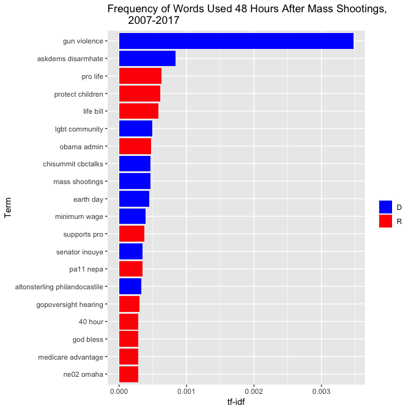
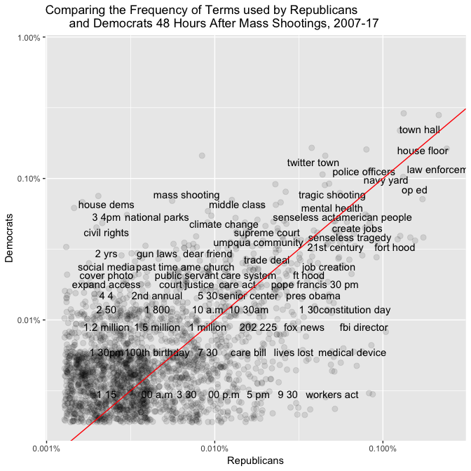
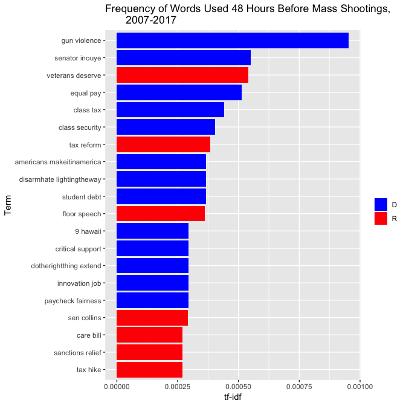
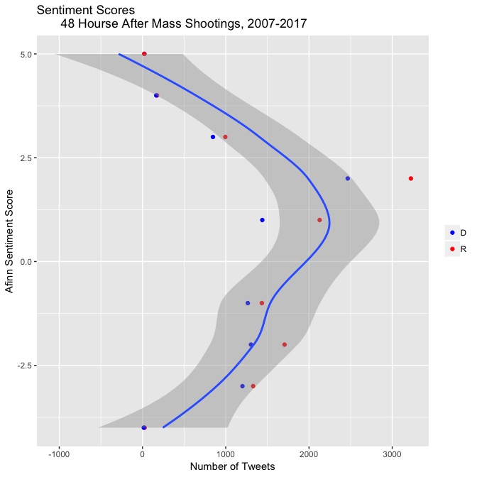
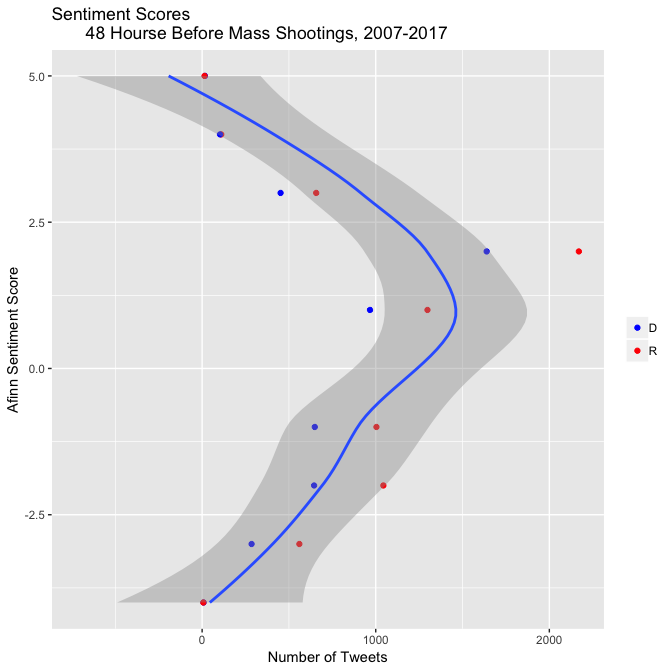
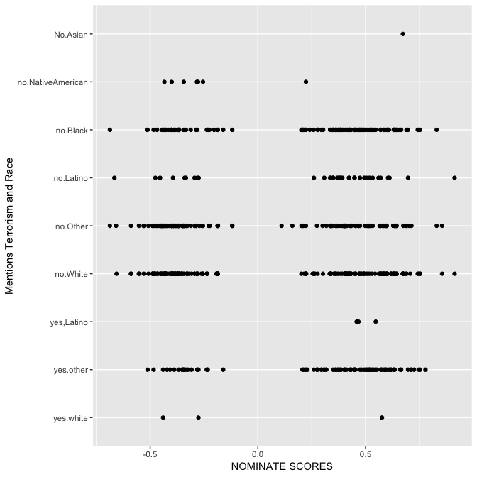
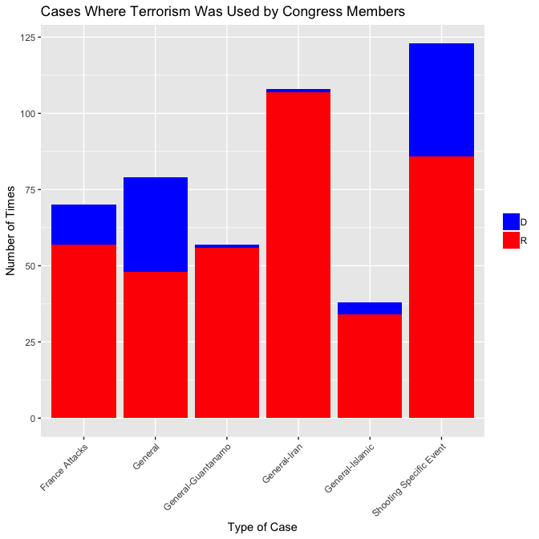

# Congress tweets after shooting

```
## # A tibble: 54,333 x 3
##    word1     word2           n
##    <chr>     <chr>       <int>
##  1 health    care          154
##  2 gun       violence      149
##  3 town      hall          148
##  4 law       enforcement   142
##  5 house     floor         129
##  6 op        ed             96
##  7 house     passed         88
##  8 president obama          82
##  9 navy      yard           79
## 10 happy     birthday       77
## # ... with 54,323 more rows
```

```
## # A tibble: 73,798 x 8
##    Date   Time  R_or_D Before_or_After… screen_name hashtags Nominate_dim2
##    <chr>  <tim> <chr>  <chr>            <chr>       <chr>            <dbl>
##  1 1/8/11 00:05 D      After            GabbyGiffo… <NA>             0.076
##  2 1/8/11 00:05 D      After            GabbyGiffo… <NA>             0.076
##  3 1/8/11 00:05 D      After            GabbyGiffo… <NA>             0.076
##  4 1/8/11 00:05 D      After            GabbyGiffo… <NA>             0.076
##  5 1/8/11 01:53 D      After            SilvestreR… <NA>             0.304
##  6 1/8/11 01:53 D      After            SilvestreR… <NA>             0.304
##  7 1/8/11 01:53 D      After            SilvestreR… <NA>             0.304
##  8 1/8/11 01:53 D      After            SilvestreR… <NA>             0.304
##  9 1/8/11 01:53 D      After            SilvestreR… <NA>             0.304
## 10 1/8/11 04:42 D      After            GabbyGiffo… <NA>             0.076
## # ... with 73,788 more rows, and 1 more variable: bigram <chr>
```

<table class="table" style="width: auto !important; margin-left: auto; margin-right: auto;">
<caption>Table 1. Highest Tfidf Bigrams in Tweets by Party 48 Hours After Shooting</caption>
 <thead>
  <tr>
   <th style="text-align:left;"> Republican or Democrat </th>
   <th style="text-align:left;"> Term </th>
   <th style="text-align:right;"> n </th>
   <th style="text-align:right;"> tf </th>
   <th style="text-align:right;"> idf </th>
   <th style="text-align:right;"> tf_idf </th>
  </tr>
 </thead>
<tbody>
  <tr>
   <td style="text-align:left;"> D </td>
   <td style="text-align:left;"> gun violence </td>
   <td style="text-align:right;"> 149 </td>
   <td style="text-align:right;"> 0.0050074 </td>
   <td style="text-align:right;"> 0.6931472 </td>
   <td style="text-align:right;"> 0.0034709 </td>
  </tr>
  <tr>
   <td style="text-align:left;"> D </td>
   <td style="text-align:left;"> askdems disarmhate </td>
   <td style="text-align:right;"> 36 </td>
   <td style="text-align:right;"> 0.0012098 </td>
   <td style="text-align:right;"> 0.6931472 </td>
   <td style="text-align:right;"> 0.0008386 </td>
  </tr>
  <tr>
   <td style="text-align:left;"> R </td>
   <td style="text-align:left;"> pro life </td>
   <td style="text-align:right;"> 40 </td>
   <td style="text-align:right;"> 0.0009082 </td>
   <td style="text-align:right;"> 0.6931472 </td>
   <td style="text-align:right;"> 0.0006295 </td>
  </tr>
  <tr>
   <td style="text-align:left;"> R </td>
   <td style="text-align:left;"> protect children </td>
   <td style="text-align:right;"> 39 </td>
   <td style="text-align:right;"> 0.0008855 </td>
   <td style="text-align:right;"> 0.6931472 </td>
   <td style="text-align:right;"> 0.0006138 </td>
  </tr>
  <tr>
   <td style="text-align:left;"> R </td>
   <td style="text-align:left;"> life bill </td>
   <td style="text-align:right;"> 37 </td>
   <td style="text-align:right;"> 0.0008401 </td>
   <td style="text-align:right;"> 0.6931472 </td>
   <td style="text-align:right;"> 0.0005823 </td>
  </tr>
  <tr>
   <td style="text-align:left;"> D </td>
   <td style="text-align:left;"> lgbt community </td>
   <td style="text-align:right;"> 21 </td>
   <td style="text-align:right;"> 0.0007057 </td>
   <td style="text-align:right;"> 0.6931472 </td>
   <td style="text-align:right;"> 0.0004892 </td>
  </tr>
  <tr>
   <td style="text-align:left;"> R </td>
   <td style="text-align:left;"> obama admin </td>
   <td style="text-align:right;"> 30 </td>
   <td style="text-align:right;"> 0.0006812 </td>
   <td style="text-align:right;"> 0.6931472 </td>
   <td style="text-align:right;"> 0.0004721 </td>
  </tr>
  <tr>
   <td style="text-align:left;"> D </td>
   <td style="text-align:left;"> chisummit cbctalks </td>
   <td style="text-align:right;"> 20 </td>
   <td style="text-align:right;"> 0.0006721 </td>
   <td style="text-align:right;"> 0.6931472 </td>
   <td style="text-align:right;"> 0.0004659 </td>
  </tr>
  <tr>
   <td style="text-align:left;"> D </td>
   <td style="text-align:left;"> mass shootings </td>
   <td style="text-align:right;"> 20 </td>
   <td style="text-align:right;"> 0.0006721 </td>
   <td style="text-align:right;"> 0.6931472 </td>
   <td style="text-align:right;"> 0.0004659 </td>
  </tr>
  <tr>
   <td style="text-align:left;"> D </td>
   <td style="text-align:left;"> earth day </td>
   <td style="text-align:right;"> 19 </td>
   <td style="text-align:right;"> 0.0006385 </td>
   <td style="text-align:right;"> 0.6931472 </td>
   <td style="text-align:right;"> 0.0004426 </td>
  </tr>
  <tr>
   <td style="text-align:left;"> D </td>
   <td style="text-align:left;"> minimum wage </td>
   <td style="text-align:right;"> 17 </td>
   <td style="text-align:right;"> 0.0005713 </td>
   <td style="text-align:right;"> 0.6931472 </td>
   <td style="text-align:right;"> 0.0003960 </td>
  </tr>
  <tr>
   <td style="text-align:left;"> R </td>
   <td style="text-align:left;"> supports pro </td>
   <td style="text-align:right;"> 24 </td>
   <td style="text-align:right;"> 0.0005449 </td>
   <td style="text-align:right;"> 0.6931472 </td>
   <td style="text-align:right;"> 0.0003777 </td>
  </tr>
  <tr>
   <td style="text-align:left;"> D </td>
   <td style="text-align:left;"> senator inouye </td>
   <td style="text-align:right;"> 15 </td>
   <td style="text-align:right;"> 0.0005041 </td>
   <td style="text-align:right;"> 0.6931472 </td>
   <td style="text-align:right;"> 0.0003494 </td>
  </tr>
  <tr>
   <td style="text-align:left;"> R </td>
   <td style="text-align:left;"> pa11 nepa </td>
   <td style="text-align:right;"> 22 </td>
   <td style="text-align:right;"> 0.0004995 </td>
   <td style="text-align:right;"> 0.6931472 </td>
   <td style="text-align:right;"> 0.0003462 </td>
  </tr>
  <tr>
   <td style="text-align:left;"> D </td>
   <td style="text-align:left;"> altonsterling philandocastile </td>
   <td style="text-align:right;"> 14 </td>
   <td style="text-align:right;"> 0.0004705 </td>
   <td style="text-align:right;"> 0.6931472 </td>
   <td style="text-align:right;"> 0.0003261 </td>
  </tr>
  <tr>
   <td style="text-align:left;"> R </td>
   <td style="text-align:left;"> gopoversight hearing </td>
   <td style="text-align:right;"> 19 </td>
   <td style="text-align:right;"> 0.0004314 </td>
   <td style="text-align:right;"> 0.6931472 </td>
   <td style="text-align:right;"> 0.0002990 </td>
  </tr>
  <tr>
   <td style="text-align:left;"> R </td>
   <td style="text-align:left;"> 40 hour </td>
   <td style="text-align:right;"> 18 </td>
   <td style="text-align:right;"> 0.0004087 </td>
   <td style="text-align:right;"> 0.6931472 </td>
   <td style="text-align:right;"> 0.0002833 </td>
  </tr>
  <tr>
   <td style="text-align:left;"> R </td>
   <td style="text-align:left;"> god bless </td>
   <td style="text-align:right;"> 18 </td>
   <td style="text-align:right;"> 0.0004087 </td>
   <td style="text-align:right;"> 0.6931472 </td>
   <td style="text-align:right;"> 0.0002833 </td>
  </tr>
  <tr>
   <td style="text-align:left;"> R </td>
   <td style="text-align:left;"> medicare advantage </td>
   <td style="text-align:right;"> 18 </td>
   <td style="text-align:right;"> 0.0004087 </td>
   <td style="text-align:right;"> 0.6931472 </td>
   <td style="text-align:right;"> 0.0002833 </td>
  </tr>
  <tr>
   <td style="text-align:left;"> R </td>
   <td style="text-align:left;"> ne02 omaha </td>
   <td style="text-align:right;"> 18 </td>
   <td style="text-align:right;"> 0.0004087 </td>
   <td style="text-align:right;"> 0.6931472 </td>
   <td style="text-align:right;"> 0.0002833 </td>
  </tr>
</tbody>
</table>

<!-- -->

#Logs Ratio for after shootings

```
## # A tibble: 54,333 x 4
##    bigram                    D         R logratio
##    <chr>                 <dbl>     <dbl>    <dbl>
##  1 families affected 0.000214  0.000213  -0.00276
##  2 protect americans 0.0000714 0.0000712 -0.00276
##  3 sandy hook        0.0000714 0.0000712 -0.00276
##  4 2 2               0.000202  0.000203   0.00561
##  5 bipartisan bill   0.000202  0.000203   0.00561
##  6 middle school     0.000155  0.000152  -0.0138 
##  7 1 2               0.000250  0.000254   0.0174 
##  8 care reform       0.0000832 0.0000813 -0.0234 
##  9 committee hearing 0.000166  0.000163  -0.0234 
## 10 families friends  0.0000832 0.0000813 -0.0234 
## # ... with 54,323 more rows
```

<!-- -->

#Comparing words frequency by plotting(after shooting)


```
## # A tibble: 56,844 x 5
## # Groups:   R_or_D [2]
##    R_or_D bigram              n total    freq
##    <chr>  <chr>           <int> <int>   <dbl>
##  1 D      gun violence      149 29756 0.00501
##  2 R      law enforcement   103 44042 0.00234
##  3 R      health care        96 44042 0.00218
##  4 R      house passed       77 44042 0.00175
##  5 R      house floor        76 44042 0.00173
##  6 D      town hall          75 29756 0.00252
##  7 R      town hall          73 44042 0.00166
##  8 R      op ed              68 44042 0.00154
##  9 R      president obama    62 44042 0.00141
## 10 R      watch live         60 44042 0.00136
## # ... with 56,834 more rows
```

```
## # A tibble: 54,333 x 3
##    bigram              D         R
##    <chr>           <dbl>     <dbl>
##  1 1 15        0.0000336 0.0000227
##  2 1 15pm      0.0000336 0.0000227
##  3 1 40        0.0000336 0.0000227
##  4 1 45        0.0000336 0.0000227
##  5 1.3 billion 0.0000336 0.0000227
##  6 1.9 million 0.0000336 0.0000227
##  7 10 10       0.0000336 0.0000227
##  8 100 million 0.0000336 0.0000227
##  9 100 people  0.0000336 0.0000227
## 10 100 rating  0.0000336 0.0000227
## # ... with 54,323 more rows
```

<!-- -->

#Congress tweets before shootings


```
## # A tibble: 104,813 x 2
##    word          n
##    <fct>     <int>
##  1 of the      719
##  2 on the      555
##  3 in the      524
##  4 to the      494
##  5 the house   333
##  6 for the     327
##  7 at the      275
##  8 thank you   236
##  9 will be     216
## 10 proud to    207
## # ... with 104,803 more rows
```

```
## # A tibble: 38,515 x 3
##    word1     word2        n
##    <chr>     <chr>    <int>
##  1 health    care       111
##  2 house     floor      111
##  3 town      hall        78
##  4 watch     live        74
##  5 op        ed          72
##  6 middle    class       70
##  7 american  people      63
##  8 national  security    59
##  9 happy     birthday    56
## 10 president obama       47
## # ... with 38,505 more rows
```

```
## # A tibble: 49,640 x 12
##    Date   Time  R_or_D Before_or_After… screen_name hashtags Nominate_dim2
##    <chr>  <tim> <chr>  <chr>            <chr>       <chr>            <dbl>
##  1 1/10/… 00:02 D      Before           RepVisclos… <NA>             0.246
##  2 1/10/… 00:02 D      Before           RepVisclos… <NA>             0.246
##  3 1/10/… 00:02 D      Before           RepVisclos… <NA>             0.246
##  4 1/10/… 00:02 D      Before           RepVisclos… <NA>             0.246
##  5 1/10/… 00:59 R      Before           RepKayGran… <NA>             0.231
##  6 1/10/… 00:59 R      Before           RepKayGran… <NA>             0.231
##  7 1/10/… 00:59 R      Before           RepKayGran… <NA>             0.231
##  8 1/10/… 03:39 R      Before           DevinNunes  <NA>             0.194
##  9 1/10/… 03:39 R      Before           DevinNunes  <NA>             0.194
## 10 1/10/… 03:39 R      Before           DevinNunes  <NA>             0.194
## # ... with 49,630 more rows, and 5 more variables: X9 <chr>, X10 <chr>,
## #   X11 <chr>, X12 <chr>, bigram <chr>
```

<table class="table" style="width: auto !important; margin-left: auto; margin-right: auto;">
<caption>Table 1. Highest Tfidf Bigrams in Tweets by Party 48 hours Before Shooting</caption>
 <thead>
  <tr>
   <th style="text-align:left;"> Republican or Democrat </th>
   <th style="text-align:left;"> Term </th>
   <th style="text-align:right;"> n </th>
   <th style="text-align:right;"> tf </th>
   <th style="text-align:right;"> idf </th>
   <th style="text-align:right;"> tf_idf </th>
  </tr>
 </thead>
<tbody>
  <tr>
   <td style="text-align:left;"> D </td>
   <td style="text-align:left;"> gun violence </td>
   <td style="text-align:right;"> 26 </td>
   <td style="text-align:right;"> 0.0013760 </td>
   <td style="text-align:right;"> 0.6931472 </td>
   <td style="text-align:right;"> 0.0009538 </td>
  </tr>
  <tr>
   <td style="text-align:left;"> D </td>
   <td style="text-align:left;"> senator inouye </td>
   <td style="text-align:right;"> 15 </td>
   <td style="text-align:right;"> 0.0007939 </td>
   <td style="text-align:right;"> 0.6931472 </td>
   <td style="text-align:right;"> 0.0005503 </td>
  </tr>
  <tr>
   <td style="text-align:left;"> R </td>
   <td style="text-align:left;"> veterans deserve </td>
   <td style="text-align:right;"> 24 </td>
   <td style="text-align:right;"> 0.0007806 </td>
   <td style="text-align:right;"> 0.6931472 </td>
   <td style="text-align:right;"> 0.0005411 </td>
  </tr>
  <tr>
   <td style="text-align:left;"> D </td>
   <td style="text-align:left;"> equal pay </td>
   <td style="text-align:right;"> 14 </td>
   <td style="text-align:right;"> 0.0007409 </td>
   <td style="text-align:right;"> 0.6931472 </td>
   <td style="text-align:right;"> 0.0005136 </td>
  </tr>
  <tr>
   <td style="text-align:left;"> D </td>
   <td style="text-align:left;"> class tax </td>
   <td style="text-align:right;"> 12 </td>
   <td style="text-align:right;"> 0.0006351 </td>
   <td style="text-align:right;"> 0.6931472 </td>
   <td style="text-align:right;"> 0.0004402 </td>
  </tr>
  <tr>
   <td style="text-align:left;"> D </td>
   <td style="text-align:left;"> class security </td>
   <td style="text-align:right;"> 11 </td>
   <td style="text-align:right;"> 0.0005822 </td>
   <td style="text-align:right;"> 0.6931472 </td>
   <td style="text-align:right;"> 0.0004035 </td>
  </tr>
  <tr>
   <td style="text-align:left;"> R </td>
   <td style="text-align:left;"> tax reform </td>
   <td style="text-align:right;"> 17 </td>
   <td style="text-align:right;"> 0.0005529 </td>
   <td style="text-align:right;"> 0.6931472 </td>
   <td style="text-align:right;"> 0.0003833 </td>
  </tr>
  <tr>
   <td style="text-align:left;"> D </td>
   <td style="text-align:left;"> americans makeitinamerica </td>
   <td style="text-align:right;"> 10 </td>
   <td style="text-align:right;"> 0.0005292 </td>
   <td style="text-align:right;"> 0.6931472 </td>
   <td style="text-align:right;"> 0.0003668 </td>
  </tr>
  <tr>
   <td style="text-align:left;"> D </td>
   <td style="text-align:left;"> disarmhate lightingtheway </td>
   <td style="text-align:right;"> 10 </td>
   <td style="text-align:right;"> 0.0005292 </td>
   <td style="text-align:right;"> 0.6931472 </td>
   <td style="text-align:right;"> 0.0003668 </td>
  </tr>
  <tr>
   <td style="text-align:left;"> D </td>
   <td style="text-align:left;"> student debt </td>
   <td style="text-align:right;"> 10 </td>
   <td style="text-align:right;"> 0.0005292 </td>
   <td style="text-align:right;"> 0.6931472 </td>
   <td style="text-align:right;"> 0.0003668 </td>
  </tr>
  <tr>
   <td style="text-align:left;"> R </td>
   <td style="text-align:left;"> floor speech </td>
   <td style="text-align:right;"> 16 </td>
   <td style="text-align:right;"> 0.0005204 </td>
   <td style="text-align:right;"> 0.6931472 </td>
   <td style="text-align:right;"> 0.0003607 </td>
  </tr>
  <tr>
   <td style="text-align:left;"> D </td>
   <td style="text-align:left;"> 9 hawaii </td>
   <td style="text-align:right;"> 8 </td>
   <td style="text-align:right;"> 0.0004234 </td>
   <td style="text-align:right;"> 0.6931472 </td>
   <td style="text-align:right;"> 0.0002935 </td>
  </tr>
  <tr>
   <td style="text-align:left;"> D </td>
   <td style="text-align:left;"> critical support </td>
   <td style="text-align:right;"> 8 </td>
   <td style="text-align:right;"> 0.0004234 </td>
   <td style="text-align:right;"> 0.6931472 </td>
   <td style="text-align:right;"> 0.0002935 </td>
  </tr>
  <tr>
   <td style="text-align:left;"> D </td>
   <td style="text-align:left;"> dotherightthing extend </td>
   <td style="text-align:right;"> 8 </td>
   <td style="text-align:right;"> 0.0004234 </td>
   <td style="text-align:right;"> 0.6931472 </td>
   <td style="text-align:right;"> 0.0002935 </td>
  </tr>
  <tr>
   <td style="text-align:left;"> D </td>
   <td style="text-align:left;"> innovation job </td>
   <td style="text-align:right;"> 8 </td>
   <td style="text-align:right;"> 0.0004234 </td>
   <td style="text-align:right;"> 0.6931472 </td>
   <td style="text-align:right;"> 0.0002935 </td>
  </tr>
  <tr>
   <td style="text-align:left;"> D </td>
   <td style="text-align:left;"> paycheck fairness </td>
   <td style="text-align:right;"> 8 </td>
   <td style="text-align:right;"> 0.0004234 </td>
   <td style="text-align:right;"> 0.6931472 </td>
   <td style="text-align:right;"> 0.0002935 </td>
  </tr>
  <tr>
   <td style="text-align:left;"> R </td>
   <td style="text-align:left;"> sen collins </td>
   <td style="text-align:right;"> 13 </td>
   <td style="text-align:right;"> 0.0004228 </td>
   <td style="text-align:right;"> 0.6931472 </td>
   <td style="text-align:right;"> 0.0002931 </td>
  </tr>
  <tr>
   <td style="text-align:left;"> R </td>
   <td style="text-align:left;"> care bill </td>
   <td style="text-align:right;"> 12 </td>
   <td style="text-align:right;"> 0.0003903 </td>
   <td style="text-align:right;"> 0.6931472 </td>
   <td style="text-align:right;"> 0.0002705 </td>
  </tr>
  <tr>
   <td style="text-align:left;"> R </td>
   <td style="text-align:left;"> sanctions relief </td>
   <td style="text-align:right;"> 12 </td>
   <td style="text-align:right;"> 0.0003903 </td>
   <td style="text-align:right;"> 0.6931472 </td>
   <td style="text-align:right;"> 0.0002705 </td>
  </tr>
  <tr>
   <td style="text-align:left;"> R </td>
   <td style="text-align:left;"> tax hike </td>
   <td style="text-align:right;"> 12 </td>
   <td style="text-align:right;"> 0.0003903 </td>
   <td style="text-align:right;"> 0.6931472 </td>
   <td style="text-align:right;"> 0.0002705 </td>
  </tr>
</tbody>
</table>

<!-- -->
#Logs Ratio for before shooting


```
## # A tibble: 38,515 x 4
##    bigram                     D         R logratio
##    <chr>                  <dbl>     <dbl>    <dbl>
##  1 1 million          0.0000871 0.0000866 -0.00533
##  2 7 30               0.0000871 0.0000866 -0.00533
##  3 save lives         0.0000871 0.0000866 -0.00533
##  4 step forward       0.0000871 0.0000866 -0.00533
##  5 30 pm              0.000105  0.000101  -0.0335 
##  6 american flag      0.000105  0.000101  -0.0335 
##  7 gabrielle giffords 0.000105  0.000101  -0.0335 
##  8 6 30               0.0000697 0.0000722  0.0355 
##  9 appropriations act 0.0000697 0.0000722  0.0355 
## 10 beautiful day      0.0000697 0.0000722  0.0355 
## # ... with 38,505 more rows
```

<!-- -->
#Comparing all graphs

<!-- --><!-- -->

#Joining before and after shooting dataframes


```
## # A tibble: 87,300 x 3
##    word1     word2           n
##    <chr>     <chr>       <int>
##  1 health    care          265
##  2 house     floor         240
##  3 town      hall          226
##  4 gun       violence      175
##  5 op        ed            168
##  6 law       enforcement   161
##  7 watch     live          144
##  8 happy     birthday      133
##  9 president obama         129
## 10 house     passed        126
## # ... with 87,290 more rows
```

```
## # A tibble: 123,413 x 12
##    Date   Time  R_or_D Before_or_After… screen_name hashtags Nominate_dim2
##    <chr>  <tim> <chr>  <chr>            <chr>       <chr>            <dbl>
##  1 1/10/… 00:02 D      Before           RepVisclos… <NA>             0.246
##  2 1/10/… 00:02 D      Before           RepVisclos… <NA>             0.246
##  3 1/10/… 00:02 D      Before           RepVisclos… <NA>             0.246
##  4 1/10/… 00:02 D      Before           RepVisclos… <NA>             0.246
##  5 1/10/… 00:59 R      Before           RepKayGran… <NA>             0.231
##  6 1/10/… 00:59 R      Before           RepKayGran… <NA>             0.231
##  7 1/10/… 00:59 R      Before           RepKayGran… <NA>             0.231
##  8 1/10/… 03:39 R      Before           DevinNunes  <NA>             0.194
##  9 1/10/… 03:39 R      Before           DevinNunes  <NA>             0.194
## 10 1/10/… 03:39 R      Before           DevinNunes  <NA>             0.194
## # ... with 123,403 more rows, and 5 more variables: X9 <chr>, X10 <chr>,
## #   X11 <chr>, X12 <chr>, bigram <chr>
```
#Words over time


```
## # A tibble: 910 x 6
##    time_floor          R_or_D bigram           count time_total word_total
##    <dttm>              <chr>  <chr>            <int>      <int>      <int>
##  1 2009-01-01 00:00:00 D      30 pm                1        596         43
##  2 2009-01-01 00:00:00 D      american people      1        596        120
##  3 2009-01-01 00:00:00 D      capitol hill         1        596         45
##  4 2009-01-01 00:00:00 D      committee heari…     1        596         36
##  5 2009-01-01 00:00:00 D      fort hood            1        596         63
##  6 2009-01-01 00:00:00 D      health care          7        596        265
##  7 2009-01-01 00:00:00 D      health insurance     2        596         41
##  8 2009-01-01 00:00:00 D      house floor          2        596        240
##  9 2009-01-01 00:00:00 D      listen live          4        596         72
## 10 2009-01-01 00:00:00 D      op ed                2        596        168
## # ... with 900 more rows
```

```
## # A tibble: 200 x 3
##    R_or_D bigram            data            
##    <chr>  <chr>             <list>          
##  1 D      30 pm             <tibble [6 × 4]>
##  2 D      american people   <tibble [6 × 4]>
##  3 D      capitol hill      <tibble [5 × 4]>
##  4 D      committee hearing <tibble [7 × 4]>
##  5 D      fort hood         <tibble [2 × 4]>
##  6 D      health care       <tibble [7 × 4]>
##  7 D      health insurance  <tibble [7 × 4]>
##  8 D      house floor       <tibble [7 × 4]>
##  9 D      listen live       <tibble [5 × 4]>
## 10 D      op ed             <tibble [7 × 4]>
## # ... with 190 more rows
```

```
## # A tibble: 200 x 4
##    R_or_D bigram            data             models   
##    <chr>  <chr>             <list>           <list>   
##  1 D      30 pm             <tibble [6 × 4]> <S3: glm>
##  2 D      american people   <tibble [6 × 4]> <S3: glm>
##  3 D      capitol hill      <tibble [5 × 4]> <S3: glm>
##  4 D      committee hearing <tibble [7 × 4]> <S3: glm>
##  5 D      fort hood         <tibble [2 × 4]> <S3: glm>
##  6 D      health care       <tibble [7 × 4]> <S3: glm>
##  7 D      health insurance  <tibble [7 × 4]> <S3: glm>
##  8 D      house floor       <tibble [7 × 4]> <S3: glm>
##  9 D      listen live       <tibble [5 × 4]> <S3: glm>
## 10 D      op ed             <tibble [7 × 4]> <S3: glm>
## # ... with 190 more rows
```

```
## # A tibble: 24 x 8
##    R_or_D bigram         term      estimate   std.error statistic  p.value
##    <chr>  <chr>          <chr>        <dbl>       <dbl>     <dbl>    <dbl>
##  1 D      health care    time_flo… -7.07e-9     1.75e-9     -4.05 5.21e- 5
##  2 D      listen live    time_flo… -2.20e-8     5.11e-9     -4.31 1.66e- 5
##  3 D      police office… time_flo…  2.07e-8     4.87e-9      4.25 2.11e- 5
##  4 R      30 pm          time_flo… -1.44e-8     2.58e-9     -5.57 2.56e- 8
##  5 R      fort hood      time_flo… -1.14e-8     1.81e-9     -6.27 3.61e-10
##  6 R      health care    time_flo… -1.31e-8     1.20e-9    -11.0  4.22e-28
##  7 R      house gop      time_flo… -1.72e-8     2.85e-9     -6.06 1.36e- 9
##  8 R      press confere… time_flo… -1.12e-8     2.65e-9     -4.22 2.46e- 5
##  9 R      town hall      time_flo… -6.14e-9     1.51e-9     -4.06 4.96e- 5
## 10 R      create jobs    time_flo… -1.53e-8     2.69e-9     -5.70 1.22e- 8
## # ... with 14 more rows, and 1 more variable: adjusted.p.value <dbl>
```

<!-- --><!-- -->

#Building a dtm to find association

```
## <<SimpleCorpus>>
## Metadata:  corpus specific: 1, document level (indexed): 0
## Content:  documents: 17902
```

```
## <<TermDocumentMatrix (terms: 19813, documents: 17902)>>
## Non-/sparse entries: 184359/354507967
## Sparsity           : 100%
## Maximal term length: 45
## Weighting          : term frequency (tf)
```

```
## $terror
## iranian notonec    iran sponsor 
##    0.34    0.30    0.21    0.20
```

```
## <<SimpleCorpus>>
## Metadata:  corpus specific: 1, document level (indexed): 0
## Content:  documents: 11680
```

```
## <<TermDocumentMatrix (terms: 15548, documents: 11680)>>
## Non-/sparse entries: 119964/181480676
## Sparsity           : 100%
## Maximal term length: 38
## Weighting          : term frequency (tf)
```

```
## $terror
## notonec sponsor   franc    nice 
##    0.24    0.22    0.21    0.20
```

```
## <<SimpleCorpus>>
## Metadata:  corpus specific: 1, document level (indexed): 0
## Content:  documents: 10718
```

```
## <<TermDocumentMatrix (terms: 13466, documents: 10718)>>
## Non-/sparse entries: 108303/144220285
## Sparsity           : 100%
## Maximal term length: 32
## Weighting          : term frequency (tf)
```

<table class="kable_wrapper table table-striped" style="margin-left: auto; margin-right: auto;">
<caption>Words correlated with the word terror at r&gt;0.2 among Republicans</caption>
<tbody>
  <tr>
   <td> 

<table>
 <thead>
  <tr>
   <th style="text-align:left;">   </th>
   <th style="text-align:right;"> r </th>
  </tr>
 </thead>
<tbody>
  <tr>
   <td style="text-align:left;"> iranian </td>
   <td style="text-align:right;"> 0.38 </td>
  </tr>
  <tr>
   <td style="text-align:left;"> notonec </td>
   <td style="text-align:right;"> 0.33 </td>
  </tr>
  <tr>
   <td style="text-align:left;"> sponsor </td>
   <td style="text-align:right;"> 0.25 </td>
  </tr>
  <tr>
   <td style="text-align:left;"> iran </td>
   <td style="text-align:right;"> 0.24 </td>
  </tr>
  <tr>
   <td style="text-align:left;"> victim </td>
   <td style="text-align:right;"> 0.22 </td>
  </tr>
  <tr>
   <td style="text-align:left;"> repmeehan </td>
   <td style="text-align:right;"> 0.22 </td>
  </tr>
  <tr>
   <td style="text-align:left;"> justic </td>
   <td style="text-align:right;"> 0.21 </td>
  </tr>
  <tr>
   <td style="text-align:left;"> statesponsor </td>
   <td style="text-align:right;"> 0.21 </td>
  </tr>
</tbody>
</table>

 </td>
  </tr>
</tbody>
<tfoot><tr><td style="padding: 0; border: 0;" colspan="100%">
<sup>1</sup> Footnote1; notonec refers to the hashtag NotOneCent. The hashtag was used during Iran nuclear negotions by those who opposed unfreezing Iran's assetts. </td></tr></tfoot>
</table>

```
## <<SimpleCorpus>>
## Metadata:  corpus specific: 1, document level (indexed): 0
## Content:  documents: 7184
```

```
## <<TermDocumentMatrix (terms: 11467, documents: 7184)>>
## Non-/sparse entries: 76056/82302872
## Sparsity           : 100%
## Maximal term length: 45
## Weighting          : term frequency (tf)
```

<table class="kable_wrapper table" style="margin-left: auto; margin-right: auto;">
<caption>Words correlated with the word terror at r&gt;0.2 among Democrats</caption>
<tbody>
  <tr>
   <td> 

<table>
 <thead>
  <tr>
   <th style="text-align:left;">   </th>
   <th style="text-align:right;"> r </th>
  </tr>
 </thead>
<tbody>
  <tr>
   <td style="text-align:left;"> impuls </td>
   <td style="text-align:right;"> 0.26 </td>
  </tr>
  <tr>
   <td style="text-align:left;"> hate </td>
   <td style="text-align:right;"> 0.22 </td>
  </tr>
</tbody>
</table>

 </td>
  </tr>
</tbody>
</table>

```
## <<SimpleCorpus>>
## Metadata:  corpus specific: 1, document level (indexed): 0
## Content:  documents: 7342
```

```
## <<TermDocumentMatrix (terms: 11027, documents: 7342)>>
## Non-/sparse entries: 74195/80886039
## Sparsity           : 100%
## Maximal term length: 33
## Weighting          : term frequency (tf)
```

<table class="kable_wrapper table" style="margin-left: auto; margin-right: auto;">
<caption>Words correlated with the word terror at r&gt;0.2 among Republicans</caption>
<tbody>
  <tr>
   <td> 

<table>
 <thead>
  <tr>
   <th style="text-align:left;">   </th>
   <th style="text-align:right;"> r </th>
  </tr>
 </thead>
<tbody>
  <tr>
   <td style="text-align:left;"> sponsor </td>
   <td style="text-align:right;"> 0.27 </td>
  </tr>
  <tr>
   <td style="text-align:left;"> notonec </td>
   <td style="text-align:right;"> 0.26 </td>
  </tr>
  <tr>
   <td style="text-align:left;"> franc </td>
   <td style="text-align:right;"> 0.23 </td>
  </tr>
  <tr>
   <td style="text-align:left;"> attack </td>
   <td style="text-align:right;"> 0.22 </td>
  </tr>
</tbody>
</table>

 </td>
  </tr>
</tbody>
<tfoot>
<tr><td style="padding: 0; border: 0;" colspan="100%">
<sup>1</sup> Footnote1; franc refers to terrorist attack in Nice, France. The attack occured on July 14,2016 exactly 48 hours before the Bouton Rouge Mass Shooting in the U.S.</td></tr>
<tr><td style="padding: 0; border: 0;" colspan="100%">
<sup>2</sup> Footnote2; notonec refers to the hashtag NotOneCent. The hashtag was used during Iran nuclear negotions by those who opposed unfreezing Iran's assetts. </td></tr>
</tfoot>
</table>

```
## <<SimpleCorpus>>
## Metadata:  corpus specific: 1, document level (indexed): 0
## Content:  documents: 4337
```

```
## <<TermDocumentMatrix (terms: 8613, documents: 4337)>>
## Non-/sparse entries: 45769/37308812
## Sparsity           : 100%
## Maximal term length: 38
## Weighting          : term frequency (tf)
```

<table class="kable_wrapper table" style="margin-left: auto; margin-right: auto;">
<caption>Words correlated with the word terror at r&gt;0.2 among Democrats</caption>
<tbody>
  <tr>
   <td> 

<table>
 <thead>
  <tr>
   <th style="text-align:left;">   </th>
   <th style="text-align:right;"> r </th>
  </tr>
 </thead>
<tbody>
  <tr>
   <td style="text-align:left;"> nice </td>
   <td style="text-align:right;"> 0.31 </td>
  </tr>
  <tr>
   <td style="text-align:left;"> prevail </td>
   <td style="text-align:right;"> 0.27 </td>
  </tr>
  <tr>
   <td style="text-align:left;"> dispos </td>
   <td style="text-align:right;"> 0.27 </td>
  </tr>
  <tr>
   <td style="text-align:left;"> intnl </td>
   <td style="text-align:right;"> 0.27 </td>
  </tr>
  <tr>
   <td style="text-align:left;"> hostil </td>
   <td style="text-align:right;"> 0.27 </td>
  </tr>
  <tr>
   <td style="text-align:left;"> houthi </td>
   <td style="text-align:right;"> 0.27 </td>
  </tr>
  <tr>
   <td style="text-align:left;"> rebel </td>
   <td style="text-align:right;"> 0.27 </td>
  </tr>
  <tr>
   <td style="text-align:left;"> unrel </td>
   <td style="text-align:right;"> 0.27 </td>
  </tr>
  <tr>
   <td style="text-align:left;"> yemen </td>
   <td style="text-align:right;"> 0.27 </td>
  </tr>
  <tr>
   <td style="text-align:left;"> shaken </td>
   <td style="text-align:right;"> 0.27 </td>
  </tr>
  <tr>
   <td style="text-align:left;"> dozen </td>
   <td style="text-align:right;"> 0.27 </td>
  </tr>
  <tr>
   <td style="text-align:left;"> wfranc </td>
   <td style="text-align:right;"> 0.27 </td>
  </tr>
  <tr>
   <td style="text-align:left;"> percept </td>
   <td style="text-align:right;"> 0.27 </td>
  </tr>
  <tr>
   <td style="text-align:left;"> pivot </td>
   <td style="text-align:right;"> 0.27 </td>
  </tr>
  <tr>
   <td style="text-align:left;"> rcdefens </td>
   <td style="text-align:right;"> 0.27 </td>
  </tr>
  <tr>
   <td style="text-align:left;"> suggest </td>
   <td style="text-align:right;"> 0.27 </td>
  </tr>
  <tr>
   <td style="text-align:left;"> appal </td>
   <td style="text-align:right;"> 0.27 </td>
  </tr>
  <tr>
   <td style="text-align:left;"> providersclin </td>
   <td style="text-align:right;"> 0.27 </td>
  </tr>
  <tr>
   <td style="text-align:left;"> threatsact </td>
   <td style="text-align:right;"> 0.27 </td>
  </tr>
</tbody>
</table>

 </td>
  </tr>
</tbody>
<tfoot><tr><td style="padding: 0; border: 0;" colspan="100%">
<sup>1</sup> Footnote1; nice refers to terrorist attack in Nice, France. The attack occured on July 14,2016 exactly 48 hours before the Bouton Rouge Mass Shooting in the U.S. </td></tr></tfoot>
</table>

#Sentiment Analysis
Need my tokens to be words instead of bigrams for sentiment analysis. So i change my tokens to words first

<!-- --><!-- --><!-- -->


#Logistic Regression

```
## # A tibble: 475 x 16
##    Date   Time   R_or_D Before_or_After… screen_name text         hashtags
##    <chr>  <time> <chr>  <chr>            <chr>       <chr>        <chr>   
##  1 12/3/… 13:10  R      After            Robert_Ade… Contortions… SanBern…
##  2 6/12/… 19:02  R      After            RepMarthaR… We must dis… <NA>    
##  3 6/12/… 18:59  R      After            RepMarthaR… This is the… <NA>    
##  4 6/12/… 18:51  R      After            RepMarthaR… Horrified &… <NA>    
##  5 6/12/… 18:24  R      After            USRepGaryP… My thoughts… Orlando 
##  6 10/1/… 19:02  R      After            USRepGaryP… "#NotOneCen… NotOneC…
##  7 10/1/… 16:10  R      After            USRepGaryP… See @RepMee… NotOneC…
##  8 6/11/… 22:16  R      After            USRepGaryP… "Proud to s… <NA>    
##  9 10/2/… 15:02  R      After            RepFrenchH… ICYMI: My s… <NA>    
## 10 10/1/… 21:23  R      After            RepFrenchH… Here is why… NotOneC…
## # ... with 465 more rows, and 9 more variables: Nominate_dim2 <dbl>,
## #   X9 <chr>, X10 <chr>, X11 <chr>, X12 <chr>, case <chr>,
## #   total_victims <int>, mental_health_issues <chr>, race <chr>
```

<!-- -->

```
## 
## Call:
## glm(formula = mentions_terror ~ R_or_D + Nominate_dim2, family = "binomial", 
##     data = df2)
## 
## Deviance Residuals: 
##     Min       1Q   Median       3Q      Max  
## -0.2107  -0.1998  -0.1959  -0.1164   3.1945  
## 
## Coefficients:
##               Estimate Std. Error z value Pr(>|z|)    
## (Intercept)    -5.0111     0.1151 -43.525   <2e-16 ***
## R_or_DR         1.1076     0.1279   8.659   <2e-16 ***
## Nominate_dim2  -0.1411     0.1842  -0.766    0.444    
## ---
## Signif. codes:  0 '***' 0.001 '**' 0.01 '*' 0.05 '.' 0.1 ' ' 1
## 
## (Dispersion parameter for binomial family taken to be 1)
## 
##     Null deviance: 4509.3  on 29579  degrees of freedom
## Residual deviance: 4416.9  on 29577  degrees of freedom
##   (45 observations deleted due to missingness)
## AIC: 4422.9
## 
## Number of Fisher Scoring iterations: 7
```

```
## # A tibble: 692 x 3
##    R_or_D Nominate_dim2  pred
##    <fct>          <dbl> <dbl>
##  1 D             -0.758 -4.90
##  2 D             -0.752 -4.91
##  3 D             -0.696 -4.91
##  4 D             -0.659 -4.92
##  5 D             -0.647 -4.92
##  6 D             -0.62  -4.92
##  7 D             -0.602 -4.93
##  8 D             -0.571 -4.93
##  9 D             -0.563 -4.93
## 10 D             -0.546 -4.93
## # ... with 682 more rows
```

<!-- -->

```
## 
## Call:
## glm(formula = Shooting_related_terrorism ~ R_or_D + Nominate_dim2 + 
##     race + race * R_or_D + race * Nominate_dim2, family = binomial(link = "logit"), 
##     data = df3)
## 
## Deviance Residuals: 
##    Min      1Q  Median      3Q     Max  
##  -8.49    0.00    0.00    0.00    8.49  
## 
## Coefficients: (1 not defined because of singularities)
##                           Estimate Std. Error    z value Pr(>|z|)    
## (Intercept)             -4.172e+15  8.542e+07 -4.884e+07   <2e-16 ***
## R_or_DR                  4.172e+15  7.787e+07  5.358e+07   <2e-16 ***
## Nominate_dim2            4.952e+10  1.002e+08  4.939e+02   <2e-16 ***
## raceOther                6.015e+15  8.636e+07  6.966e+07   <2e-16 ***
## raceWhite                3.690e+15  7.804e+07  4.728e+07   <2e-16 ***
## R_or_DR:raceOther       -3.433e+15  7.932e+07 -4.329e+07   <2e-16 ***
## R_or_DR:raceWhite               NA         NA         NA       NA    
## Nominate_dim2:raceOther -2.736e+15  1.035e+08 -2.644e+07   <2e-16 ***
## Nominate_dim2:raceWhite  4.625e+15  1.466e+08  3.154e+07   <2e-16 ***
## ---
## Signif. codes:  0 '***' 0.001 '**' 0.01 '*' 0.05 '.' 0.1 ' ' 1
## 
## (Dispersion parameter for binomial family taken to be 1)
## 
##     Null deviance:  53.00  on 116  degrees of freedom
## Residual deviance: 504.61  on 109  degrees of freedom
##   (358 observations deleted due to missingness)
## AIC: 520.61
## 
## Number of Fisher Scoring iterations: 24
```

```
## Likelihood ratio test
## 
## Model 1: Shooting_related_terrorism ~ R_or_D + Nominate_dim2 + race + 
##     race * R_or_D + race * Nominate_dim2
## Model 2: Shooting_related_terrorism ~ R_or_D + Nominate_dim2 + race
##   #Df  LogLik Df Chisq Pr(>Chisq)
## 1   7 -7.0747                    
## 2   5 -7.0747 -2     0          1
```

```
##          llh      llhNull           G2     McFadden         r2ML 
##   -7.0747493 -133.2836519  252.4178053    0.9469196    0.9898412 
##         r2CU 
##    0.9976774
```

```
## # A tibble: 1,272 x 4
##    R_or_D Nominate_dim2 race        pred
##    <fct>          <dbl> <fct>      <dbl>
##  1 D             -0.647 Latino  -4.17e15
##  2 D             -0.647 Other    3.61e15
##  3 D             -0.647 White   -3.47e15
##  4 D             -0.647 <NA>    NA      
##  5 D             -0.563 Latino  -4.17e15
##  6 D             -0.563 Other    3.38e15
##  7 D             -0.563 White   -3.09e15
##  8 D             -0.563 <NA>    NA      
##  9 D             -0.492 Latino  -4.17e15
## 10 D             -0.492 Other    3.19e15
## # ... with 1,262 more rows
```

```
## Classes 'tbl_df', 'tbl' and 'data.frame':	954 obs. of  4 variables:
##  $ R_or_D       : Factor w/ 2 levels "D","R": 1 1 1 1 1 1 1 1 1 1 ...
##  $ Nominate_dim2: num  -0.647 -0.647 -0.647 -0.563 -0.563 -0.563 -0.492 -0.492 -0.492 -0.49 ...
##  $ race         : Factor w/ 3 levels "Latino","Other",..: 1 2 3 1 2 3 1 2 3 1 ...
##  $ pred         : num  -4.17e+15 3.61e+15 -3.47e+15 -4.17e+15 3.38e+15 ...
```

<!-- -->
