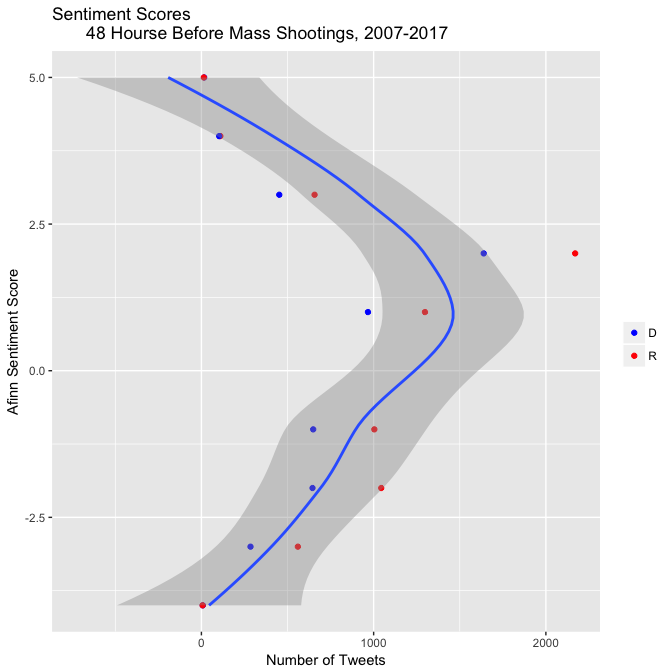

# Congress tweets after shooting

```
## # A tibble: 54,333 x 3
##    word1     word2           n
##    <chr>     <chr>       <int>
##  1 health    care          154
##  2 gun       violence      149
##  3 town      hall          148
##  4 law       enforcement   142
##  5 house     floor         129
##  6 op        ed             96
##  7 house     passed         88
##  8 president obama          82
##  9 navy      yard           79
## 10 happy     birthday       77
## # ... with 54,323 more rows
```

```
## # A tibble: 73,798 x 8
##    Date   Time  R_or_D Before_or_After screen_name  hashtags Nominate_dim1
##    <chr>  <tim> <chr>  <chr>           <chr>        <chr>            <dbl>
##  1 1/8/11 00:05 D      After           GabbyGiffor… <NA>            -0.11 
##  2 1/8/11 00:05 D      After           GabbyGiffor… <NA>            -0.11 
##  3 1/8/11 00:05 D      After           GabbyGiffor… <NA>            -0.11 
##  4 1/8/11 00:05 D      After           GabbyGiffor… <NA>            -0.11 
##  5 1/8/11 01:53 D      After           SilvestreRe… <NA>            -0.321
##  6 1/8/11 01:53 D      After           SilvestreRe… <NA>            -0.321
##  7 1/8/11 01:53 D      After           SilvestreRe… <NA>            -0.321
##  8 1/8/11 01:53 D      After           SilvestreRe… <NA>            -0.321
##  9 1/8/11 01:53 D      After           SilvestreRe… <NA>            -0.321
## 10 1/8/11 04:42 D      After           GabbyGiffor… <NA>            -0.11 
## # ... with 73,788 more rows, and 1 more variable: bigram <chr>
```

<table class="table" style="width: auto !important; margin-left: auto; margin-right: auto;">
 <thead>
  <tr>
   <th style="text-align:left;"> Republican or Democrat </th>
   <th style="text-align:left;"> Term </th>
   <th style="text-align:right;"> n </th>
   <th style="text-align:right;"> tf </th>
   <th style="text-align:right;"> idf </th>
   <th style="text-align:right;"> tf_idf </th>
  </tr>
 </thead>
<tbody>
  <tr>
   <td style="text-align:left;"> D </td>
   <td style="text-align:left;"> gun violence </td>
   <td style="text-align:right;"> 149 </td>
   <td style="text-align:right;"> 0.0050074 </td>
   <td style="text-align:right;"> 0.6931472 </td>
   <td style="text-align:right;"> 0.0034709 </td>
  </tr>
  <tr>
   <td style="text-align:left;"> D </td>
   <td style="text-align:left;"> askdems disarmhate </td>
   <td style="text-align:right;"> 36 </td>
   <td style="text-align:right;"> 0.0012098 </td>
   <td style="text-align:right;"> 0.6931472 </td>
   <td style="text-align:right;"> 0.0008386 </td>
  </tr>
  <tr>
   <td style="text-align:left;"> R </td>
   <td style="text-align:left;"> pro life </td>
   <td style="text-align:right;"> 40 </td>
   <td style="text-align:right;"> 0.0009082 </td>
   <td style="text-align:right;"> 0.6931472 </td>
   <td style="text-align:right;"> 0.0006295 </td>
  </tr>
  <tr>
   <td style="text-align:left;"> R </td>
   <td style="text-align:left;"> protect children </td>
   <td style="text-align:right;"> 39 </td>
   <td style="text-align:right;"> 0.0008855 </td>
   <td style="text-align:right;"> 0.6931472 </td>
   <td style="text-align:right;"> 0.0006138 </td>
  </tr>
  <tr>
   <td style="text-align:left;"> R </td>
   <td style="text-align:left;"> life bill </td>
   <td style="text-align:right;"> 37 </td>
   <td style="text-align:right;"> 0.0008401 </td>
   <td style="text-align:right;"> 0.6931472 </td>
   <td style="text-align:right;"> 0.0005823 </td>
  </tr>
  <tr>
   <td style="text-align:left;"> D </td>
   <td style="text-align:left;"> lgbt community </td>
   <td style="text-align:right;"> 21 </td>
   <td style="text-align:right;"> 0.0007057 </td>
   <td style="text-align:right;"> 0.6931472 </td>
   <td style="text-align:right;"> 0.0004892 </td>
  </tr>
  <tr>
   <td style="text-align:left;"> R </td>
   <td style="text-align:left;"> obama admin </td>
   <td style="text-align:right;"> 30 </td>
   <td style="text-align:right;"> 0.0006812 </td>
   <td style="text-align:right;"> 0.6931472 </td>
   <td style="text-align:right;"> 0.0004721 </td>
  </tr>
  <tr>
   <td style="text-align:left;"> D </td>
   <td style="text-align:left;"> chisummit cbctalks </td>
   <td style="text-align:right;"> 20 </td>
   <td style="text-align:right;"> 0.0006721 </td>
   <td style="text-align:right;"> 0.6931472 </td>
   <td style="text-align:right;"> 0.0004659 </td>
  </tr>
  <tr>
   <td style="text-align:left;"> D </td>
   <td style="text-align:left;"> mass shootings </td>
   <td style="text-align:right;"> 20 </td>
   <td style="text-align:right;"> 0.0006721 </td>
   <td style="text-align:right;"> 0.6931472 </td>
   <td style="text-align:right;"> 0.0004659 </td>
  </tr>
  <tr>
   <td style="text-align:left;"> D </td>
   <td style="text-align:left;"> earth day </td>
   <td style="text-align:right;"> 19 </td>
   <td style="text-align:right;"> 0.0006385 </td>
   <td style="text-align:right;"> 0.6931472 </td>
   <td style="text-align:right;"> 0.0004426 </td>
  </tr>
  <tr>
   <td style="text-align:left;"> D </td>
   <td style="text-align:left;"> minimum wage </td>
   <td style="text-align:right;"> 17 </td>
   <td style="text-align:right;"> 0.0005713 </td>
   <td style="text-align:right;"> 0.6931472 </td>
   <td style="text-align:right;"> 0.0003960 </td>
  </tr>
  <tr>
   <td style="text-align:left;"> R </td>
   <td style="text-align:left;"> supports pro </td>
   <td style="text-align:right;"> 24 </td>
   <td style="text-align:right;"> 0.0005449 </td>
   <td style="text-align:right;"> 0.6931472 </td>
   <td style="text-align:right;"> 0.0003777 </td>
  </tr>
  <tr>
   <td style="text-align:left;"> D </td>
   <td style="text-align:left;"> senator inouye </td>
   <td style="text-align:right;"> 15 </td>
   <td style="text-align:right;"> 0.0005041 </td>
   <td style="text-align:right;"> 0.6931472 </td>
   <td style="text-align:right;"> 0.0003494 </td>
  </tr>
  <tr>
   <td style="text-align:left;"> R </td>
   <td style="text-align:left;"> pa11 nepa </td>
   <td style="text-align:right;"> 22 </td>
   <td style="text-align:right;"> 0.0004995 </td>
   <td style="text-align:right;"> 0.6931472 </td>
   <td style="text-align:right;"> 0.0003462 </td>
  </tr>
  <tr>
   <td style="text-align:left;"> D </td>
   <td style="text-align:left;"> altonsterling philandocastile </td>
   <td style="text-align:right;"> 14 </td>
   <td style="text-align:right;"> 0.0004705 </td>
   <td style="text-align:right;"> 0.6931472 </td>
   <td style="text-align:right;"> 0.0003261 </td>
  </tr>
  <tr>
   <td style="text-align:left;"> R </td>
   <td style="text-align:left;"> gopoversight hearing </td>
   <td style="text-align:right;"> 19 </td>
   <td style="text-align:right;"> 0.0004314 </td>
   <td style="text-align:right;"> 0.6931472 </td>
   <td style="text-align:right;"> 0.0002990 </td>
  </tr>
  <tr>
   <td style="text-align:left;"> R </td>
   <td style="text-align:left;"> 40 hour </td>
   <td style="text-align:right;"> 18 </td>
   <td style="text-align:right;"> 0.0004087 </td>
   <td style="text-align:right;"> 0.6931472 </td>
   <td style="text-align:right;"> 0.0002833 </td>
  </tr>
  <tr>
   <td style="text-align:left;"> R </td>
   <td style="text-align:left;"> god bless </td>
   <td style="text-align:right;"> 18 </td>
   <td style="text-align:right;"> 0.0004087 </td>
   <td style="text-align:right;"> 0.6931472 </td>
   <td style="text-align:right;"> 0.0002833 </td>
  </tr>
  <tr>
   <td style="text-align:left;"> R </td>
   <td style="text-align:left;"> medicare advantage </td>
   <td style="text-align:right;"> 18 </td>
   <td style="text-align:right;"> 0.0004087 </td>
   <td style="text-align:right;"> 0.6931472 </td>
   <td style="text-align:right;"> 0.0002833 </td>
  </tr>
  <tr>
   <td style="text-align:left;"> R </td>
   <td style="text-align:left;"> ne02 omaha </td>
   <td style="text-align:right;"> 18 </td>
   <td style="text-align:right;"> 0.0004087 </td>
   <td style="text-align:right;"> 0.6931472 </td>
   <td style="text-align:right;"> 0.0002833 </td>
  </tr>
</tbody>
</table>


#Congress tweets before shootings


```
## # A tibble: 104,804 x 2
##    word          n
##    <fct>     <int>
##  1 of the      720
##  2 on the      555
##  3 in the      524
##  4 to the      494
##  5 the house   333
##  6 for the     327
##  7 at the      275
##  8 thank you   236
##  9 will be     216
## 10 proud to    207
## # ... with 104,794 more rows
```

```
## # A tibble: 38,511 x 3
##    word1     word2        n
##    <chr>     <chr>    <int>
##  1 health    care       111
##  2 house     floor      111
##  3 town      hall        78
##  4 watch     live        74
##  5 op        ed          72
##  6 middle    class       70
##  7 american  people      63
##  8 national  security    59
##  9 happy     birthday    56
## 10 president obama       47
## # ... with 38,501 more rows
```

```
## # A tibble: 49,635 x 8
##    Date   Time   R_or_D Before_or_After screen_name hashtags Nominate_dim1
##    <chr>  <time> <chr>  <chr>           <chr>       <chr>            <dbl>
##  1 1/10/… 00:02  D      Before          RepVisclos… <NA>            -0.402
##  2 1/10/… 00:02  D      Before          RepVisclos… <NA>            -0.402
##  3 1/10/… 00:02  D      Before          RepVisclos… <NA>            -0.402
##  4 1/10/… 00:02  D      Before          RepVisclos… <NA>            -0.402
##  5 1/10/… 00:59  R      Before          RepKayGran… <NA>             0.392
##  6 1/10/… 00:59  R      Before          RepKayGran… <NA>             0.392
##  7 1/10/… 00:59  R      Before          RepKayGran… <NA>             0.392
##  8 1/10/… 03:39  R      Before          DevinNunes  <NA>             0.448
##  9 1/10/… 03:39  R      Before          DevinNunes  <NA>             0.448
## 10 1/10/… 03:39  R      Before          DevinNunes  <NA>             0.448
## # ... with 49,625 more rows, and 1 more variable: bigram <chr>
```

<table class="table" style="width: auto !important; margin-left: auto; margin-right: auto;">
 <thead>
  <tr>
   <th style="text-align:left;"> Republican or Democrat </th>
   <th style="text-align:left;"> Term </th>
   <th style="text-align:right;"> n </th>
   <th style="text-align:right;"> tf </th>
   <th style="text-align:right;"> idf </th>
   <th style="text-align:right;"> tf_idf </th>
  </tr>
 </thead>
<tbody>
  <tr>
   <td style="text-align:left;"> D </td>
   <td style="text-align:left;"> gun violence </td>
   <td style="text-align:right;"> 26 </td>
   <td style="text-align:right;"> 0.0013762 </td>
   <td style="text-align:right;"> 0.6931472 </td>
   <td style="text-align:right;"> 0.0009539 </td>
  </tr>
  <tr>
   <td style="text-align:left;"> D </td>
   <td style="text-align:left;"> senator inouye </td>
   <td style="text-align:right;"> 15 </td>
   <td style="text-align:right;"> 0.0007940 </td>
   <td style="text-align:right;"> 0.6931472 </td>
   <td style="text-align:right;"> 0.0005503 </td>
  </tr>
  <tr>
   <td style="text-align:left;"> R </td>
   <td style="text-align:left;"> veterans deserve </td>
   <td style="text-align:right;"> 24 </td>
   <td style="text-align:right;"> 0.0007807 </td>
   <td style="text-align:right;"> 0.6931472 </td>
   <td style="text-align:right;"> 0.0005411 </td>
  </tr>
  <tr>
   <td style="text-align:left;"> D </td>
   <td style="text-align:left;"> equal pay </td>
   <td style="text-align:right;"> 14 </td>
   <td style="text-align:right;"> 0.0007411 </td>
   <td style="text-align:right;"> 0.6931472 </td>
   <td style="text-align:right;"> 0.0005137 </td>
  </tr>
  <tr>
   <td style="text-align:left;"> D </td>
   <td style="text-align:left;"> class tax </td>
   <td style="text-align:right;"> 12 </td>
   <td style="text-align:right;"> 0.0006352 </td>
   <td style="text-align:right;"> 0.6931472 </td>
   <td style="text-align:right;"> 0.0004403 </td>
  </tr>
  <tr>
   <td style="text-align:left;"> D </td>
   <td style="text-align:left;"> class security </td>
   <td style="text-align:right;"> 11 </td>
   <td style="text-align:right;"> 0.0005823 </td>
   <td style="text-align:right;"> 0.6931472 </td>
   <td style="text-align:right;"> 0.0004036 </td>
  </tr>
  <tr>
   <td style="text-align:left;"> R </td>
   <td style="text-align:left;"> tax reform </td>
   <td style="text-align:right;"> 17 </td>
   <td style="text-align:right;"> 0.0005530 </td>
   <td style="text-align:right;"> 0.6931472 </td>
   <td style="text-align:right;"> 0.0003833 </td>
  </tr>
  <tr>
   <td style="text-align:left;"> D </td>
   <td style="text-align:left;"> americans makeitinamerica </td>
   <td style="text-align:right;"> 10 </td>
   <td style="text-align:right;"> 0.0005293 </td>
   <td style="text-align:right;"> 0.6931472 </td>
   <td style="text-align:right;"> 0.0003669 </td>
  </tr>
  <tr>
   <td style="text-align:left;"> D </td>
   <td style="text-align:left;"> disarmhate lightingtheway </td>
   <td style="text-align:right;"> 10 </td>
   <td style="text-align:right;"> 0.0005293 </td>
   <td style="text-align:right;"> 0.6931472 </td>
   <td style="text-align:right;"> 0.0003669 </td>
  </tr>
  <tr>
   <td style="text-align:left;"> D </td>
   <td style="text-align:left;"> student debt </td>
   <td style="text-align:right;"> 10 </td>
   <td style="text-align:right;"> 0.0005293 </td>
   <td style="text-align:right;"> 0.6931472 </td>
   <td style="text-align:right;"> 0.0003669 </td>
  </tr>
  <tr>
   <td style="text-align:left;"> R </td>
   <td style="text-align:left;"> floor speech </td>
   <td style="text-align:right;"> 16 </td>
   <td style="text-align:right;"> 0.0005204 </td>
   <td style="text-align:right;"> 0.6931472 </td>
   <td style="text-align:right;"> 0.0003607 </td>
  </tr>
  <tr>
   <td style="text-align:left;"> D </td>
   <td style="text-align:left;"> 9 hawaii </td>
   <td style="text-align:right;"> 8 </td>
   <td style="text-align:right;"> 0.0004235 </td>
   <td style="text-align:right;"> 0.6931472 </td>
   <td style="text-align:right;"> 0.0002935 </td>
  </tr>
  <tr>
   <td style="text-align:left;"> D </td>
   <td style="text-align:left;"> critical support </td>
   <td style="text-align:right;"> 8 </td>
   <td style="text-align:right;"> 0.0004235 </td>
   <td style="text-align:right;"> 0.6931472 </td>
   <td style="text-align:right;"> 0.0002935 </td>
  </tr>
  <tr>
   <td style="text-align:left;"> D </td>
   <td style="text-align:left;"> dotherightthing extend </td>
   <td style="text-align:right;"> 8 </td>
   <td style="text-align:right;"> 0.0004235 </td>
   <td style="text-align:right;"> 0.6931472 </td>
   <td style="text-align:right;"> 0.0002935 </td>
  </tr>
  <tr>
   <td style="text-align:left;"> D </td>
   <td style="text-align:left;"> innovation job </td>
   <td style="text-align:right;"> 8 </td>
   <td style="text-align:right;"> 0.0004235 </td>
   <td style="text-align:right;"> 0.6931472 </td>
   <td style="text-align:right;"> 0.0002935 </td>
  </tr>
  <tr>
   <td style="text-align:left;"> D </td>
   <td style="text-align:left;"> paycheck fairness </td>
   <td style="text-align:right;"> 8 </td>
   <td style="text-align:right;"> 0.0004235 </td>
   <td style="text-align:right;"> 0.6931472 </td>
   <td style="text-align:right;"> 0.0002935 </td>
  </tr>
  <tr>
   <td style="text-align:left;"> R </td>
   <td style="text-align:left;"> sen collins </td>
   <td style="text-align:right;"> 13 </td>
   <td style="text-align:right;"> 0.0004229 </td>
   <td style="text-align:right;"> 0.6931472 </td>
   <td style="text-align:right;"> 0.0002931 </td>
  </tr>
  <tr>
   <td style="text-align:left;"> R </td>
   <td style="text-align:left;"> care bill </td>
   <td style="text-align:right;"> 12 </td>
   <td style="text-align:right;"> 0.0003903 </td>
   <td style="text-align:right;"> 0.6931472 </td>
   <td style="text-align:right;"> 0.0002706 </td>
  </tr>
  <tr>
   <td style="text-align:left;"> R </td>
   <td style="text-align:left;"> sanctions relief </td>
   <td style="text-align:right;"> 12 </td>
   <td style="text-align:right;"> 0.0003903 </td>
   <td style="text-align:right;"> 0.6931472 </td>
   <td style="text-align:right;"> 0.0002706 </td>
  </tr>
  <tr>
   <td style="text-align:left;"> R </td>
   <td style="text-align:left;"> tax hike </td>
   <td style="text-align:right;"> 12 </td>
   <td style="text-align:right;"> 0.0003903 </td>
   <td style="text-align:right;"> 0.6931472 </td>
   <td style="text-align:right;"> 0.0002706 </td>
  </tr>
</tbody>
</table>

#Joining before and after shooting dataframes


```
## # A tibble: 87,296 x 3
##    word1     word2           n
##    <chr>     <chr>       <int>
##  1 health    care          265
##  2 house     floor         240
##  3 town      hall          226
##  4 gun       violence      175
##  5 op        ed            168
##  6 law       enforcement   161
##  7 watch     live          144
##  8 happy     birthday      133
##  9 president obama         129
## 10 house     passed        126
## # ... with 87,286 more rows
```

```
## # A tibble: 123,408 x 8
##    Date   Time   R_or_D Before_or_After screen_name hashtags Nominate_dim1
##    <chr>  <time> <chr>  <chr>           <chr>       <chr>            <dbl>
##  1 1/10/… 00:02  D      Before          RepVisclos… <NA>            -0.402
##  2 1/10/… 00:02  D      Before          RepVisclos… <NA>            -0.402
##  3 1/10/… 00:02  D      Before          RepVisclos… <NA>            -0.402
##  4 1/10/… 00:02  D      Before          RepVisclos… <NA>            -0.402
##  5 1/10/… 00:59  R      Before          RepKayGran… <NA>             0.392
##  6 1/10/… 00:59  R      Before          RepKayGran… <NA>             0.392
##  7 1/10/… 00:59  R      Before          RepKayGran… <NA>             0.392
##  8 1/10/… 03:39  R      Before          DevinNunes  <NA>             0.448
##  9 1/10/… 03:39  R      Before          DevinNunes  <NA>             0.448
## 10 1/10/… 03:39  R      Before          DevinNunes  <NA>             0.448
## # ... with 123,398 more rows, and 1 more variable: bigram <chr>
```
#Words over time


```
## # A tibble: 910 x 6
##    time_floor          R_or_D bigram           count time_total word_total
##    <dttm>              <chr>  <chr>            <int>      <int>      <int>
##  1 2009-01-01 00:00:00 D      30 pm                1        596         43
##  2 2009-01-01 00:00:00 D      american people      1        596        120
##  3 2009-01-01 00:00:00 D      capitol hill         1        596         45
##  4 2009-01-01 00:00:00 D      committee heari…     1        596         36
##  5 2009-01-01 00:00:00 D      fort hood            1        596         63
##  6 2009-01-01 00:00:00 D      health care          7        596        265
##  7 2009-01-01 00:00:00 D      health insurance     2        596         41
##  8 2009-01-01 00:00:00 D      house floor          2        596        240
##  9 2009-01-01 00:00:00 D      listen live          4        596         72
## 10 2009-01-01 00:00:00 D      op ed                2        596        168
## # ... with 900 more rows
```

```
## # A tibble: 200 x 3
##    R_or_D bigram            data            
##    <chr>  <chr>             <list>          
##  1 D      30 pm             <tibble [6 × 4]>
##  2 D      american people   <tibble [6 × 4]>
##  3 D      capitol hill      <tibble [5 × 4]>
##  4 D      committee hearing <tibble [7 × 4]>
##  5 D      fort hood         <tibble [2 × 4]>
##  6 D      health care       <tibble [7 × 4]>
##  7 D      health insurance  <tibble [7 × 4]>
##  8 D      house floor       <tibble [7 × 4]>
##  9 D      listen live       <tibble [5 × 4]>
## 10 D      op ed             <tibble [7 × 4]>
## # ... with 190 more rows
```

```
## # A tibble: 200 x 4
##    R_or_D bigram            data             models   
##    <chr>  <chr>             <list>           <list>   
##  1 D      30 pm             <tibble [6 × 4]> <S3: glm>
##  2 D      american people   <tibble [6 × 4]> <S3: glm>
##  3 D      capitol hill      <tibble [5 × 4]> <S3: glm>
##  4 D      committee hearing <tibble [7 × 4]> <S3: glm>
##  5 D      fort hood         <tibble [2 × 4]> <S3: glm>
##  6 D      health care       <tibble [7 × 4]> <S3: glm>
##  7 D      health insurance  <tibble [7 × 4]> <S3: glm>
##  8 D      house floor       <tibble [7 × 4]> <S3: glm>
##  9 D      listen live       <tibble [5 × 4]> <S3: glm>
## 10 D      op ed             <tibble [7 × 4]> <S3: glm>
## # ... with 190 more rows
```

```
## # A tibble: 24 x 8
##    R_or_D bigram         term      estimate   std.error statistic  p.value
##    <chr>  <chr>          <chr>        <dbl>       <dbl>     <dbl>    <dbl>
##  1 D      health care    time_flo… -7.07e-9     1.75e-9     -4.05 5.22e- 5
##  2 D      listen live    time_flo… -2.20e-8     5.11e-9     -4.31 1.66e- 5
##  3 D      police office… time_flo…  2.07e-8     4.87e-9      4.25 2.10e- 5
##  4 R      30 pm          time_flo… -1.44e-8     2.58e-9     -5.57 2.57e- 8
##  5 R      fort hood      time_flo… -1.14e-8     1.81e-9     -6.27 3.62e-10
##  6 R      health care    time_flo… -1.31e-8     1.20e-9    -11.0  4.24e-28
##  7 R      house gop      time_flo… -1.72e-8     2.85e-9     -6.06 1.36e- 9
##  8 R      press confere… time_flo… -1.12e-8     2.65e-9     -4.22 2.46e- 5
##  9 R      town hall      time_flo… -6.14e-9     1.51e-9     -4.06 4.96e- 5
## 10 R      create jobs    time_flo… -1.53e-8     2.69e-9     -5.70 1.22e- 8
## # ... with 14 more rows, and 1 more variable: adjusted.p.value <dbl>
```

<!-- --><!-- -->

#Building a dtm to find association

```
## <<SimpleCorpus>>
## Metadata:  corpus specific: 1, document level (indexed): 0
## Content:  documents: 17902
```

```
## <<TermDocumentMatrix (terms: 19813, documents: 17902)>>
## Non-/sparse entries: 184359/354507967
## Sparsity           : 100%
## Maximal term length: 45
## Weighting          : term frequency (tf)
```

```
## $terror
## iranian notonec    iran sponsor 
##    0.34    0.30    0.21    0.20
```

```
## $gun
## violenc  askdem disarmh 
##    0.47    0.34    0.32
```

```
## <<SimpleCorpus>>
## Metadata:  corpus specific: 1, document level (indexed): 0
## Content:  documents: 11679
```

```
## <<TermDocumentMatrix (terms: 15546, documents: 11679)>>
## Non-/sparse entries: 119964/181441770
## Sparsity           : 100%
## Maximal term length: 38
## Weighting          : term frequency (tf)
```

```
## $terror
## notonec sponsor   franc    nice 
##    0.24    0.22    0.21    0.20
```

```
## $gun
##        violenc      highcapac        disarmh     lautenberg           sprt 
##           0.47           0.31           0.29           0.26           0.23 
## lightingtheway        magazin 
##           0.21           0.21
```

```
## <<SimpleCorpus>>
## Metadata:  corpus specific: 1, document level (indexed): 0
## Content:  documents: 10718
```

```
## <<TermDocumentMatrix (terms: 13466, documents: 10718)>>
## Non-/sparse entries: 108303/144220285
## Sparsity           : 100%
## Maximal term length: 32
## Weighting          : term frequency (tf)
```

<table class="kable_wrapper table table-striped" style="margin-left: auto; margin-right: auto;">
<caption>Words correlated with the word terror at r&gt;0.2 among Republicans</caption>
<tbody>
  <tr>
   <td> 

<table>
 <thead>
  <tr>
   <th style="text-align:left;">   </th>
   <th style="text-align:right;"> r </th>
  </tr>
 </thead>
<tbody>
  <tr>
   <td style="text-align:left;"> iranian </td>
   <td style="text-align:right;"> 0.38 </td>
  </tr>
  <tr>
   <td style="text-align:left;"> notonec </td>
   <td style="text-align:right;"> 0.33 </td>
  </tr>
  <tr>
   <td style="text-align:left;"> sponsor </td>
   <td style="text-align:right;"> 0.25 </td>
  </tr>
  <tr>
   <td style="text-align:left;"> iran </td>
   <td style="text-align:right;"> 0.24 </td>
  </tr>
  <tr>
   <td style="text-align:left;"> victim </td>
   <td style="text-align:right;"> 0.22 </td>
  </tr>
  <tr>
   <td style="text-align:left;"> repmeehan </td>
   <td style="text-align:right;"> 0.22 </td>
  </tr>
  <tr>
   <td style="text-align:left;"> justic </td>
   <td style="text-align:right;"> 0.21 </td>
  </tr>
  <tr>
   <td style="text-align:left;"> statesponsor </td>
   <td style="text-align:right;"> 0.21 </td>
  </tr>
</tbody>
</table>

 </td>
  </tr>
</tbody>
<tfoot><tr><td style="padding: 0; border: 0;" colspan="100%">
<sup>1</sup> Footnote1; notonec refers to the hashtag NotOneCent. The hashtag was used during Iran nuclear negotions by those who opposed unfreezing Iran's assetts. </td></tr></tfoot>
</table>

<table class="kable_wrapper table table-striped" style="margin-left: auto; margin-right: auto;">
<caption>Words correlated with the word gun at r&gt;0.2 among Republicans</caption>
<tbody>
  <tr>
   <td> 

<table>
 <thead>
  <tr>
   <th style="text-align:left;">   </th>
   <th style="text-align:right;"> r </th>
  </tr>
 </thead>
<tbody>
  <tr>
   <td style="text-align:left;"> chicagopolic </td>
   <td style="text-align:right;"> 0.46 </td>
  </tr>
  <tr>
   <td style="text-align:left;"> tyshawnle </td>
   <td style="text-align:right;"> 0.46 </td>
  </tr>
  <tr>
   <td style="text-align:left;"> lawabid </td>
   <td style="text-align:right;"> 0.28 </td>
  </tr>
  <tr>
   <td style="text-align:left;"> astound </td>
   <td style="text-align:right;"> 0.23 </td>
  </tr>
  <tr>
   <td style="text-align:left;"> contort </td>
   <td style="text-align:right;"> 0.23 </td>
  </tr>
  <tr>
   <td style="text-align:left;"> sanbernadinoshoot </td>
   <td style="text-align:right;"> 0.23 </td>
  </tr>
  <tr>
   <td style="text-align:left;"> shi </td>
   <td style="text-align:right;"> 0.23 </td>
  </tr>
  <tr>
   <td style="text-align:left;"> “jrubinblogg </td>
   <td style="text-align:right;"> 0.23 </td>
  </tr>
  <tr>
   <td style="text-align:left;"> shareact </td>
   <td style="text-align:right;"> 0.23 </td>
  </tr>
  <tr>
   <td style="text-align:left;"> abdulazeez </td>
   <td style="text-align:right;"> 0.23 </td>
  </tr>
  <tr>
   <td style="text-align:left;"> muhammad </td>
   <td style="text-align:right;"> 0.23 </td>
  </tr>
  <tr>
   <td style="text-align:left;"> relativ </td>
   <td style="text-align:right;"> 0.23 </td>
  </tr>
  <tr>
   <td style="text-align:left;"> incens </td>
   <td style="text-align:right;"> 0.23 </td>
  </tr>
  <tr>
   <td style="text-align:left;"> bal </td>
   <td style="text-align:right;"> 0.23 </td>
  </tr>
  <tr>
   <td style="text-align:left;"> bobkkob </td>
   <td style="text-align:right;"> 0.23 </td>
  </tr>
  <tr>
   <td style="text-align:left;"> strict </td>
   <td style="text-align:right;"> 0.23 </td>
  </tr>
  <tr>
   <td style="text-align:left;"> talkmonst </td>
   <td style="text-align:right;"> 0.23 </td>
  </tr>
  <tr>
   <td style="text-align:left;"> oann </td>
   <td style="text-align:right;"> 0.23 </td>
  </tr>
  <tr>
   <td style="text-align:left;"> wemilymil </td>
   <td style="text-align:right;"> 0.23 </td>
  </tr>
  <tr>
   <td style="text-align:left;"> divert </td>
   <td style="text-align:right;"> 0.23 </td>
  </tr>
  <tr>
   <td style="text-align:left;"> rigellreport </td>
   <td style="text-align:right;"> 0.23 </td>
  </tr>
  <tr>
   <td style="text-align:left;"> pend </td>
   <td style="text-align:right;"> 0.20 </td>
  </tr>
</tbody>
</table>

 </td>
  </tr>
</tbody>
</table>

```
## <<SimpleCorpus>>
## Metadata:  corpus specific: 1, document level (indexed): 0
## Content:  documents: 7184
```

```
## <<TermDocumentMatrix (terms: 11467, documents: 7184)>>
## Non-/sparse entries: 76056/82302872
## Sparsity           : 100%
## Maximal term length: 45
## Weighting          : term frequency (tf)
```

<table class="kable_wrapper table" style="margin-left: auto; margin-right: auto;">
<caption>Words correlated with the word terror at r&gt;0.2 among Democrats</caption>
<tbody>
  <tr>
   <td> 

<table>
 <thead>
  <tr>
   <th style="text-align:left;">   </th>
   <th style="text-align:right;"> r </th>
  </tr>
 </thead>
<tbody>
  <tr>
   <td style="text-align:left;"> impuls </td>
   <td style="text-align:right;"> 0.26 </td>
  </tr>
  <tr>
   <td style="text-align:left;"> hate </td>
   <td style="text-align:right;"> 0.22 </td>
  </tr>
</tbody>
</table>

 </td>
  </tr>
</tbody>
</table>

<table class="kable_wrapper table" style="margin-left: auto; margin-right: auto;">
<caption>Words correlated with the word gun at r&gt;0.2 among Democrats</caption>
<tbody>
  <tr>
   <td> 

<table>
 <thead>
  <tr>
   <th style="text-align:left;">   </th>
   <th style="text-align:right;"> r </th>
  </tr>
 </thead>
<tbody>
  <tr>
   <td style="text-align:left;"> violenc </td>
   <td style="text-align:right;"> 0.54 </td>
  </tr>
  <tr>
   <td style="text-align:left;"> askdem </td>
   <td style="text-align:right;"> 0.34 </td>
  </tr>
  <tr>
   <td style="text-align:left;"> disarmh </td>
   <td style="text-align:right;"> 0.33 </td>
  </tr>
  <tr>
   <td style="text-align:left;"> terrorist </td>
   <td style="text-align:right;"> 0.22 </td>
  </tr>
</tbody>
</table>

 </td>
  </tr>
</tbody>
</table>

```
## <<SimpleCorpus>>
## Metadata:  corpus specific: 1, document level (indexed): 0
## Content:  documents: 7342
```

```
## <<TermDocumentMatrix (terms: 11027, documents: 7342)>>
## Non-/sparse entries: 74195/80886039
## Sparsity           : 100%
## Maximal term length: 33
## Weighting          : term frequency (tf)
```

<table class="kable_wrapper table" style="margin-left: auto; margin-right: auto;">
<caption>Words correlated with the word terror at r&gt;0.2 among Republicans</caption>
<tbody>
  <tr>
   <td> 

<table>
 <thead>
  <tr>
   <th style="text-align:left;">   </th>
   <th style="text-align:right;"> r </th>
  </tr>
 </thead>
<tbody>
  <tr>
   <td style="text-align:left;"> sponsor </td>
   <td style="text-align:right;"> 0.27 </td>
  </tr>
  <tr>
   <td style="text-align:left;"> notonec </td>
   <td style="text-align:right;"> 0.26 </td>
  </tr>
  <tr>
   <td style="text-align:left;"> franc </td>
   <td style="text-align:right;"> 0.23 </td>
  </tr>
  <tr>
   <td style="text-align:left;"> attack </td>
   <td style="text-align:right;"> 0.22 </td>
  </tr>
</tbody>
</table>

 </td>
  </tr>
</tbody>
<tfoot>
<tr><td style="padding: 0; border: 0;" colspan="100%">
<sup>1</sup> Footnote1; franc refers to terrorist attack in Nice, France. The attack occured on July 14,2016 exactly 48 hours before the Bouton Rouge Mass Shooting in the U.S.</td></tr>
<tr><td style="padding: 0; border: 0;" colspan="100%">
<sup>2</sup> Footnote2; notonec refers to the hashtag NotOneCent. The hashtag was used during Iran nuclear negotions by those who opposed unfreezing Iran's assetts. </td></tr>
</tfoot>
</table>

<table class="kable_wrapper table" style="margin-left: auto; margin-right: auto;">
<caption>Words correlated with the word gun at r&gt;0.2 among Republicans</caption>
<tbody>
  <tr>
   <td> 

<table>
 <thead>
  <tr>
   <th style="text-align:left;">   </th>
   <th style="text-align:right;"> r </th>
  </tr>
 </thead>
<tbody>
  <tr>
   <td style="text-align:left;"> budgetcutt </td>
   <td style="text-align:right;"> 0.35 </td>
  </tr>
  <tr>
   <td style="text-align:left;"> fastandfuri </td>
   <td style="text-align:right;"> 0.35 </td>
  </tr>
  <tr>
   <td style="text-align:left;"> horror </td>
   <td style="text-align:right;"> 0.35 </td>
  </tr>
  <tr>
   <td style="text-align:left;"> atf </td>
   <td style="text-align:right;"> 0.25 </td>
  </tr>
  <tr>
   <td style="text-align:left;"> most </td>
   <td style="text-align:right;"> 0.25 </td>
  </tr>
  <tr>
   <td style="text-align:left;"> express </td>
   <td style="text-align:right;"> 0.24 </td>
  </tr>
  <tr>
   <td style="text-align:left;"> truck </td>
   <td style="text-align:right;"> 0.22 </td>
  </tr>
  <tr>
   <td style="text-align:left;"> bomb </td>
   <td style="text-align:right;"> 0.21 </td>
  </tr>
  <tr>
   <td style="text-align:left;"> deer </td>
   <td style="text-align:right;"> 0.20 </td>
  </tr>
  <tr>
   <td style="text-align:left;"> today‚äô </td>
   <td style="text-align:right;"> 0.20 </td>
  </tr>
</tbody>
</table>

 </td>
  </tr>
</tbody>
</table>

```
## <<SimpleCorpus>>
## Metadata:  corpus specific: 1, document level (indexed): 0
## Content:  documents: 4337
```

```
## <<TermDocumentMatrix (terms: 8613, documents: 4337)>>
## Non-/sparse entries: 45769/37308812
## Sparsity           : 100%
## Maximal term length: 38
## Weighting          : term frequency (tf)
```

<table class="kable_wrapper table" style="margin-left: auto; margin-right: auto;">
<caption>Words correlated with the word terror at r&gt;0.2 among Democrats</caption>
<tbody>
  <tr>
   <td> 

<table>
 <thead>
  <tr>
   <th style="text-align:left;">   </th>
   <th style="text-align:right;"> r </th>
  </tr>
 </thead>
<tbody>
  <tr>
   <td style="text-align:left;"> nice </td>
   <td style="text-align:right;"> 0.31 </td>
  </tr>
  <tr>
   <td style="text-align:left;"> prevail </td>
   <td style="text-align:right;"> 0.27 </td>
  </tr>
  <tr>
   <td style="text-align:left;"> dispos </td>
   <td style="text-align:right;"> 0.27 </td>
  </tr>
  <tr>
   <td style="text-align:left;"> intnl </td>
   <td style="text-align:right;"> 0.27 </td>
  </tr>
  <tr>
   <td style="text-align:left;"> hostil </td>
   <td style="text-align:right;"> 0.27 </td>
  </tr>
  <tr>
   <td style="text-align:left;"> houthi </td>
   <td style="text-align:right;"> 0.27 </td>
  </tr>
  <tr>
   <td style="text-align:left;"> rebel </td>
   <td style="text-align:right;"> 0.27 </td>
  </tr>
  <tr>
   <td style="text-align:left;"> unrel </td>
   <td style="text-align:right;"> 0.27 </td>
  </tr>
  <tr>
   <td style="text-align:left;"> yemen </td>
   <td style="text-align:right;"> 0.27 </td>
  </tr>
  <tr>
   <td style="text-align:left;"> shaken </td>
   <td style="text-align:right;"> 0.27 </td>
  </tr>
  <tr>
   <td style="text-align:left;"> dozen </td>
   <td style="text-align:right;"> 0.27 </td>
  </tr>
  <tr>
   <td style="text-align:left;"> wfranc </td>
   <td style="text-align:right;"> 0.27 </td>
  </tr>
  <tr>
   <td style="text-align:left;"> percept </td>
   <td style="text-align:right;"> 0.27 </td>
  </tr>
  <tr>
   <td style="text-align:left;"> pivot </td>
   <td style="text-align:right;"> 0.27 </td>
  </tr>
  <tr>
   <td style="text-align:left;"> rcdefens </td>
   <td style="text-align:right;"> 0.27 </td>
  </tr>
  <tr>
   <td style="text-align:left;"> suggest </td>
   <td style="text-align:right;"> 0.27 </td>
  </tr>
  <tr>
   <td style="text-align:left;"> appal </td>
   <td style="text-align:right;"> 0.27 </td>
  </tr>
  <tr>
   <td style="text-align:left;"> providersclin </td>
   <td style="text-align:right;"> 0.27 </td>
  </tr>
  <tr>
   <td style="text-align:left;"> threatsact </td>
   <td style="text-align:right;"> 0.27 </td>
  </tr>
</tbody>
</table>

 </td>
  </tr>
</tbody>
<tfoot><tr><td style="padding: 0; border: 0;" colspan="100%">
<sup>1</sup> Footnote1; nice refers to terrorist attack in Nice, France. The attack occured on July 14,2016 exactly 48 hours before the Bouton Rouge Mass Shooting in the U.S. </td></tr></tfoot>
</table>

#Sentiment Analysis AFINN
Need my tokens to be words instead of bigrams for sentiment analysis. So i change my tokens to words first

<!-- --><!-- --><!-- -->

#Logistic Regression

```
## # A tibble: 475 x 12
##    Date   Time  R_or_D Before_or_After screen_name text         hashtags  
##    <chr>  <tim> <chr>  <chr>           <chr>       <chr>        <chr>     
##  1 12/3/… 18:21 D      After           RepDeSauln… Over the la… Terrorist…
##  2 6/13/… 18:39 D      After           LorettaSan… Let's stand… PrayForOr…
##  3 12/3/… 01:56 D      After           AGBecerra   It’s time t… gunviolen…
##  4 6/13/… 14:19 D      After           BradSherman My deepest … OrlandoUn…
##  5 11/27… 15:37 D      After           BradSherman Will be on … terrorism…
##  6 6/13/… 17:59 D      After           RepAdamSch… Donald Trum… <NA>      
##  7 6/13/… 17:58 D      After           RepAdamSch… Donald Trum… <NA>      
##  8 6/13/… 13:40 D      After           RepAdamSch… The mass sh… Orlando   
##  9 6/12/… 16:38 D      After           RepAdamSch… This mornin… Orlando   
## 10 12/3/… 17:26 D      After           RepAdamSch… FBI is cond… <NA>      
## # ... with 465 more rows, and 5 more variables: Nominate_dim1 <dbl>,
## #   case <chr>, total_victims <int>, mental_health_issues <chr>,
## #   race <chr>
```

<!-- -->

```
## 
## Call:
## glm(formula = mentions_terror ~ R_or_D + Nominate_dim1, family = "binomial", 
##     data = df2)
## 
## Deviance Residuals: 
##     Min       1Q   Median       3Q      Max  
## -0.2084  -0.1817  -0.1725  -0.1102   3.2620  
## 
## Coefficients:
##               Estimate Std. Error z value Pr(>|z|)    
## (Intercept)    -4.8780     0.1721 -28.344   <2e-16 ***
## R_or_DR         0.4556     0.3204   1.422   0.1550    
## Nominate_dim1   0.6568     0.3497   1.878   0.0604 .  
## ---
## Signif. codes:  0 '***' 0.001 '**' 0.01 '*' 0.05 '.' 0.1 ' ' 1
## 
## (Dispersion parameter for binomial family taken to be 1)
## 
##     Null deviance: 3889.9  on 29579  degrees of freedom
## Residual deviance: 3820.1  on 29577  degrees of freedom
##   (116 observations deleted due to missingness)
## AIC: 3826.1
## 
## Number of Fisher Scoring iterations: 7
```

```
## # A tibble: 708 x 3
##    R_or_D Nominate_dim1  pred
##    <fct>          <dbl> <dbl>
##  1 D             -0.767 -5.38
##  2 D             -0.687 -5.33
##  3 D             -0.666 -5.32
##  4 D             -0.658 -5.31
##  5 D             -0.656 -5.31
##  6 D             -0.599 -5.27
##  7 D             -0.589 -5.26
##  8 D             -0.585 -5.26
##  9 D             -0.582 -5.26
## 10 D             -0.580 -5.26
## # ... with 698 more rows
```

<!-- -->

```
## 
## Call:
## glm(formula = Shooting_related_terrorism ~ race * R_or_D + race * 
##     Nominate_dim1, family = binomial(link = "logit"), data = df3)
## 
## Deviance Residuals: 
##    Min      1Q  Median      3Q     Max  
##  -8.49    0.00    0.00    0.00    8.49  
## 
## Coefficients: (1 not defined because of singularities)
##                           Estimate Std. Error    z value Pr(>|z|)    
## (Intercept)              2.520e+16  5.557e+08  4.534e+07   <2e-16 ***
## raceOther               -2.192e+16  5.561e+08 -3.942e+07   <2e-16 ***
## raceWhite               -1.465e+16  4.678e+08 -3.131e+07   <2e-16 ***
## R_or_DR                 -2.070e+16  3.738e+08 -5.537e+07   <2e-16 ***
## Nominate_dim1            2.188e+10  8.614e+08  2.540e+01   <2e-16 ***
## raceOther:R_or_DR        2.090e+16  3.759e+08  5.559e+07   <2e-16 ***
## raceWhite:R_or_DR               NA         NA         NA       NA    
## raceOther:Nominate_dim1 -6.444e+14  8.626e+08 -7.470e+05   <2e-16 ***
## raceWhite:Nominate_dim1  2.552e+16  9.372e+08  2.723e+07   <2e-16 ***
## ---
## Signif. codes:  0 '***' 0.001 '**' 0.01 '*' 0.05 '.' 0.1 ' ' 1
## 
## (Dispersion parameter for binomial family taken to be 1)
## 
##     Null deviance:  45.997  on 104  degrees of freedom
## Residual deviance: 432.524  on  97  degrees of freedom
##   (370 observations deleted due to missingness)
## AIC: 448.52
## 
## Number of Fisher Scoring iterations: 23
```

```
## [1] 0.1399738
```

```
## # A tibble: 1,136 x 4
##    R_or_D Nominate_dim1 race        pred
##    <fct>          <dbl> <fct>      <dbl>
##  1 D             -0.666 Latino   2.52e16
##  2 D             -0.666 Other    3.70e15
##  3 D             -0.666 White   -6.45e15
##  4 D             -0.666 <NA>    NA      
##  5 D             -0.564 Latino   2.52e16
##  6 D             -0.564 Other    3.64e15
##  7 D             -0.564 White   -3.84e15
##  8 D             -0.564 <NA>    NA      
##  9 D             -0.552 Latino   2.52e16
## 10 D             -0.552 Other    3.63e15
## # ... with 1,126 more rows
```

```
## Classes 'tbl_df', 'tbl' and 'data.frame':	852 obs. of  4 variables:
##  $ R_or_D       : Factor w/ 2 levels "D","R": 1 1 1 1 1 1 1 1 1 1 ...
##  $ Nominate_dim1: num  -0.666 -0.666 -0.666 -0.564 -0.564 -0.564 -0.552 -0.552 -0.552 -0.53 ...
##  $ race         : Factor w/ 3 levels "Latino","Other",..: 1 2 3 1 2 3 1 2 3 1 ...
##  $ pred         : num  2.52e+16 3.70e+15 -6.45e+15 2.52e+16 3.64e+15 ...
```

<!-- -->
